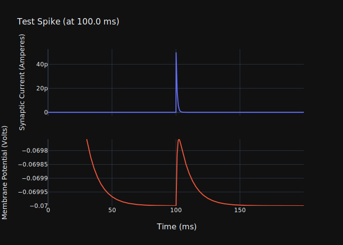
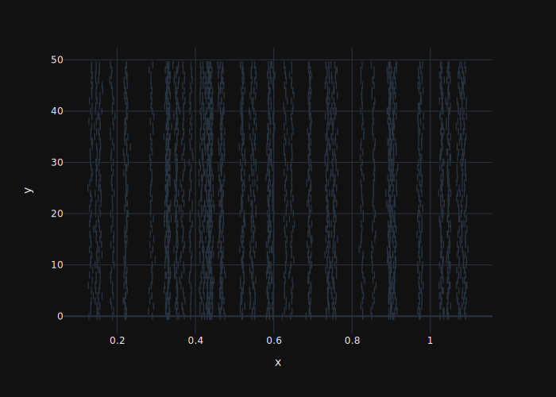
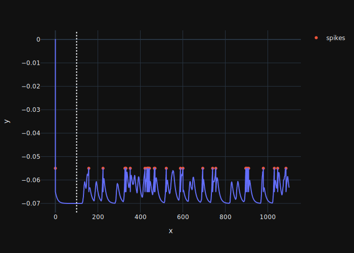
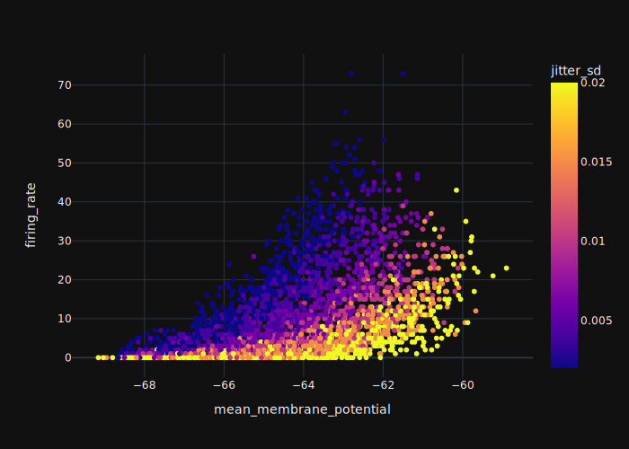
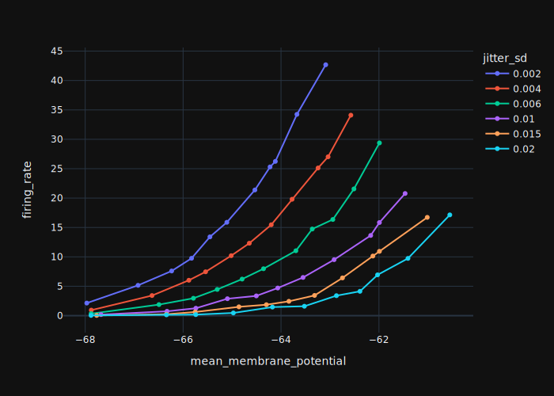
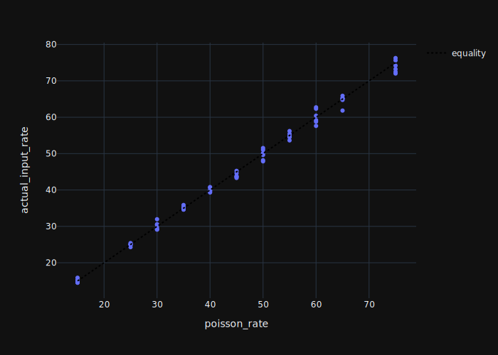
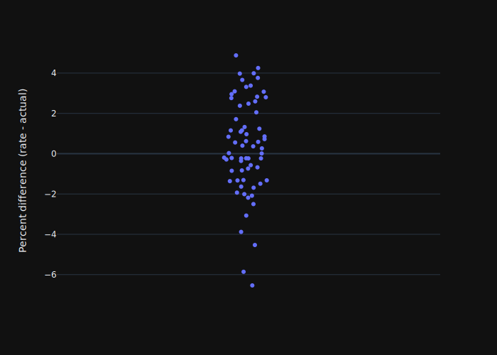
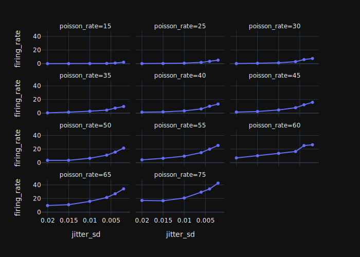
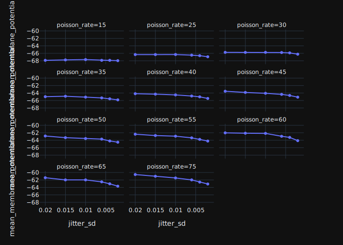

```python
# Env vars and utilities for execution
```
```python
import os

GLOBAL_ENV_VARS = {
    'WRITE_FIG': True,  # whether to write new figures
    'SHOW_FIG': False,  # whether to show new figures
    'RUN_LONG': False,  # whether to run long tasks
}

print('***\nSetting Env Variables\n***\n')
for GEV, DEFAULT_VALUE in GLOBAL_ENV_VARS.items():
    runtime_value = os.environ.get(GEV)  # defaults to None
    # parse strings into booleans, but only if actual value provided
    if runtime_value:
        new_value = (
                True
                    if runtime_value == "True"
                    else False
                )
    # if none provided, just take default value
    else:
        new_value = DEFAULT_VALUE
    print(f'Setting {GEV:<10} ... from {str(DEFAULT_VALUE):<5} to {str(new_value):<5} (runtime value: {runtime_value})')
    GLOBAL_ENV_VARS[GEV] = new_value

def show_fig(fig):
    if GLOBAL_ENV_VARS['SHOW_FIG']:
        fig.show()

def write_fig(fig, file_name: str, **kwargs):
    if GLOBAL_ENV_VARS['WRITE_FIG']:
        fig.write_image(file_name, **kwargs)
```
```python
# # Imports and setup
```
```python
from dataclasses import dataclass

from typing import Union

import numpy as np
import pandas as pd
import brian2 as bn
from brian2 import (
    units as bnun,
    Network,
    defaultclock,
    PoissonGroup,
    PoissonInput
)
from brian2.equations.equations import parse_string_equations
bn.__version__
```
```python
from lif import *
```
```python
import plotly.express as px
import plotly.graph_objects as go
import plotly.subplots as psp
```


# Stanley pure excitatory Feedforward approach


See Stanley et al 2012, Wang et al 2010, Kelly et al 2014


## Prototype


### Functions


All essential operations, including creation of the brian objects and equations for running
the simulation are here.

```python
def mk_core_params(
        n_inputs: int=50, jitter_sd: float=0.002, poisson_rate: float=50,
        jitter_buffer: float=0.1, run_time: float=1
        ):
    return {
        'n_inputs': n_inputs,
        'jitter_sd': jitter_sd * bnun.second,
        'poisson_rate': poisson_rate * bnun.Hz,
        'jitter_buffer': jitter_buffer * bnun.second,
        'run_time': run_time * bnun.second
    }

def mk_single_poisson_input(core_params: dict):

    psn_inpt = PoissonGroup(1, core_params['poisson_rate'])
    psn_inpt_spikes_mnt = bn.SpikeMonitor(psn_inpt)
    ntwk = Network([psn_inpt, psn_inpt_spikes_mnt])

    ntwk.run(core_params['run_time'])
    psn_inpt_spikes = psn_inpt_spikes_mnt.spike_trains()[0]

    return psn_inpt_spikes

def mk_multiple_synchronous_poisson_inputs(
        psn_spikes, core_params
        ):

    (jitter_sd, n_inputs, jitter_buffer) = (core_params[p] for p in
        ['jitter_sd', 'n_inputs', 'jitter_buffer']
        )

    jitter = (
        np.random.normal(
            loc=0, scale=jitter_sd,
            size=(n_inputs, psn_spikes.size)
            )
        * bnun.second
        )
    all_psn_inpt_spikes = (jitter + psn_spikes) + jitter_buffer
    # rectify any negative to zero
    # really shouldn't be any or many at all with the buffer
    all_psn_inpt_spikes[all_psn_inpt_spikes<0] = 0
    # sort spikes within each neuron
    all_psn_inpt_spikes = np.sort(all_psn_inpt_spikes, axis=1)

    return all_psn_inpt_spikes

def mk_spike_index_arrays_for_spike_generator(
        all_psn_inpt_spikes, core_params):

    (n_inputs,) = (
        core_params[p] for p in
        ['n_inputs']
        )
    n_spikes_per_input = all_psn_inpt_spikes.shape[1]
    # intervals correspond to spike `1` (second spike) to the end
    spike_idxs = np.r_[
            [
                # subtract 1 as to match interval and start from second spike
                (np.ones(n_spikes_per_input-1) * i)
                for i in range(n_inputs)
            ]
        ]

    spk_intvl = np.abs(all_psn_inpt_spikes[:, 1:] - all_psn_inpt_spikes[:, 0:-1])
    spk_intvl_within_dt_idx = (spk_intvl <= (defaultclock.dt))
    n_spikes_within_dt = np.sum(spk_intvl_within_dt_idx)

    # exclude the first spike from masking, as always included
    spks_flat_without_multi = np.r_[
        all_psn_inpt_spikes[:, 0],
        all_psn_inpt_spikes[:,1:][~spk_intvl_within_dt_idx]
        ]

    # check that total spikes is right amount
    assert (
        (all_psn_inpt_spikes.flatten().shape - n_spikes_within_dt)
        ==
        spks_flat_without_multi.shape
        )

    spks_idxs_flat = np.r_[
        np.arange(n_inputs),  # index for all the first spikes
        spike_idxs[~spk_intvl_within_dt_idx]  # already excludes the first spikes
    ]

    # sort
    input_spks_sorted_args = spks_flat_without_multi.argsort()
    input_spks_sorted = spks_flat_without_multi[input_spks_sorted_args]
    input_spks_idxs = spks_idxs_flat[input_spks_sorted_args]

    return n_spikes_within_dt, input_spks_idxs, input_spks_sorted

def mk_simulation_params(
        v_rest=-70, tau_m=10, v_thres=-55, v_reset=-65,
        EPSC=0.05, tau_EPSC=0.85, g_EPSC=14.2
        ):

    return {
        'v_rest': v_rest * bnun.mV,
        'tau_m': tau_m * bnun.msecond,
        'v_thres': v_thres * bnun.mV,
        'v_reset': v_reset * bnun.mV,
        'EPSC': EPSC * bnun.nA,
        'tau_EPSC': tau_EPSC * bnun.msecond,
        'g_EPSC': g_EPSC * bnun.nsiemens,
    }


def mk_simulation(
        sim_params, input_spks_idxs, input_spks_sorted, core_params
        ):

    (n_inputs,) = (
        core_params[p] for p in
        ['n_inputs']
        )

    # equations
    eqs = '''
    dv/dt = (v_rest - v + (I/g_EPSC))/tau_m : volt
    dI/dt = -I/tau_EPSC : amp
    '''

    on_pre =    'I += EPSC'
    threshold = 'v>v_thres'
    reset =     'v = v_reset'

    G = bn.NeuronGroup(
        1, eqs,
        threshold=threshold, reset=reset,
        namespace=sim_params,
        method='euler')

    # custom spike inputs
    PS = bn.SpikeGeneratorGroup(
        n_inputs,
        input_spks_idxs,
        input_spks_sorted*bnun.second, sorted=True)
    S = bn.Synapses(PS, G, on_pre=on_pre, namespace=sim_params)
    # S.connect(i=0, j=0)
    S.connect(i=np.arange(n_inputs), j=0)

    M = bn.StateMonitor(G, 'v', record=True)
    SM = bn.SpikeMonitor(G)

    IM = bn.StateMonitor(G, 'I', record=True)
    ntwk = Network([G, PS, S, M, IM, SM])
    ntwk.store('initial')

    return M, IM, SM, PS, ntwk

def update_spike_generator(
        ntwk, input_spike_group, core_params
        ):
    ntwk.restore('initial')
    psn_spikes = mk_single_poisson_input(core_params)
    all_psn_spks = mk_multiple_synchronous_poisson_inputs(psn_spikes, core_params)
    n_dropped_spks, input_spk_idxs, input_spk_times = (
        mk_spike_index_arrays_for_spike_generator(all_psn_spks, core_params)
        )

    input_spike_group.set_spikes(
            indices=input_spk_idxs,
            times=input_spk_times*bnun.second,
            sorted=True)

    return n_dropped_spks, all_psn_spks, input_spk_idxs, input_spk_times, ntwk

def simulation_averages(
        v_mon, spike_mon, input_spk_times, core_params
        ):

    (n_inputs, jitter_buffer, run_time) = (
        core_params[p] for p in
        ['n_inputs', 'jitter_buffer', 'run_time']
        )

    spike_times = spike_mon.all_values()['t'][0]
    idxs_past_jitter_buffer = v_mon.t > jitter_buffer
    input_spike_rate = len(input_spk_times) / n_inputs / run_time
    mean_membrane_potential = np.mean(v_mon.v[0][idxs_past_jitter_buffer])
    cell_spike_rate = len(spike_times[spike_times>(jitter_buffer)]) / run_time

    return input_spike_rate, mean_membrane_potential, cell_spike_rate

def plot_cell_membrane_spikes(v_mon, spike_mon):

    spike_times = spike_mon.all_values()['t'][0]
    fig = (
        px
        .line(x=v_mon.t/bnun.ms, y=v_mon.v[0])
        .add_scatter(
            x=spike_times / bnun.ms, y=np.ones_like(spike_times)*sim_params['v_thres'],
            mode='markers', name='spikes')
        .add_shape(type='line', x0=100, x1=100, y0=0, y1=1, yref='paper', line_dash='dot')
    )
    return fig

def plot_test_spike(v_mon, i_mon, test_spike_time):

    fig = (
        psp
        .make_subplots(
            rows=2, cols=1, shared_xaxes=True,
            x_title='Time (ms)'
            )
        .add_scatter(
            row=1, col=1,
            # name='Current',
            mode='lines',
            x=i_mon.t/bnun.ms, y=i_mon.I[0],
            )
        .add_scatter(
            row=2, col=1,
            # name='Potential',
            mode='lines',
            x=v_mon.t/bnun.ms, y=v_mon.v[0],
            )
        .update_yaxes(
            row=2,
            range=[
                sim_params['v_rest'],
                np.max(v_mon.v[0][v_mon.t > (test_spike_time*bnun.second)]),
                ]
            )
        .update_layout(
            title=f'Test Spike (at {test_spike_time*bnun.second/bnun.msecond} ms)',
            showlegend=False,
            yaxis_title='Synaptic Current (Amperes)',
            yaxis2_title='Membrane Potential (Volts)'
            )
        )
    return fig
```

### Characterise and Test


Characterise the membrane potential and synaptic current from a single spike

```python
core_params = mk_core_params(
    n_inputs=50, jitter_sd=0.002, poisson_rate=50,
    jitter_buffer=0, run_time=0.2)

test_spike_time = 0.1  # seconds

input_spk_idxs = np.array([0])
input_spk_times = np.array([test_spike_time])

sim_params = mk_simulation_params()
v_mon, i_mon, spike_mon, input_spike_group, ntwk = mk_simulation(
    sim_params, input_spk_idxs, input_spk_times, core_params)

ntwk.run(core_params['run_time']+core_params['jitter_buffer'])
```
```python
fig = plot_test_spike(v_mon, i_mon, test_spike_time)
show_fig(fig)
write_fig(
    fig.update_layout(template='plotly_dark'),
    'stanley_feedforward_test_spike.svg')
# show_fig(fig)
# fig.write_image('stanley_feedforward_test_spike.svg')
```




### Demonstration of Homogenous Poisson Input with Synchrony


Use a single homgenous poisson input spike train to generate synchronous
inputs by duplicating the initial spike train, adding a temporal jitter
and then providing these spike trains as synaptic input to a target cell.

```python
poisson_rate = 60
jitter_sd = 0.003

core_params = mk_core_params(
    poisson_rate=poisson_rate,
    jitter_sd=jitter_sd,
    n_inputs=50, jitter_buffer=0.1, run_time=1)

psn_spikes = mk_single_poisson_input(core_params)
all_psn_spks = mk_multiple_synchronous_poisson_inputs(psn_spikes, core_params)

n_dropped_spks, input_spk_idxs, input_spk_times = (
    mk_spike_index_arrays_for_spike_generator(all_psn_spks, core_params)
    )
sim_params = mk_simulation_params()
v_mon, i_mon, spike_mon, input_spike_group, ntwk = mk_simulation(
    sim_params, input_spk_idxs, input_spk_times, core_params)

# (n_dropped_spks, all_psn_spks, input_spike_idxs, input_spike_times, ntwk) = (
#     update_spike_generator(ntwk, input_spike_group, core_params)
#     )

ntwk.run(core_params['run_time']+core_params['jitter_buffer'])
actual_input_rate, mean_membrane_potential, cell_firing_rate = (
    simulation_averages(v_mon, spike_mon, input_spk_times, core_params)
    )
```
```python
fig = plot.poisson_trials_rug(all_psn_spks)
show_fig(fig)
write_fig(
    fig.update_layout(template='plotly_dark'),
    'multi_homogenous_poisson_input_spikes_rug_plot.svg')
# fig.show()
# fig.write_image('multi_homogenous_poisson_input_spikes_rug_plot.svg')
```
```python
fig = plot_cell_membrane_spikes(v_mon, spike_mon)
show_fig(fig)
write_fig(
    fig.update_layout(template='plotly_dark'),
    'homogenous_poisson_input_membrane_potential_and_spikes.svg')
# fig.show()
# fig.write_image('homogenous_poisson_input_membrane_potential_and_spikes.svg')
```


*all inputs with synchronous spike times*





*Membrane potential and spikes of target leaky and integrate cell*




```python

```

### Run Simulations


Characterise the relationship between synchrony, input firing rate and target cell output
firing rate and membrane potential.


For various values of `poisson_rate` and `jitter_sd`, run a number of simulations, record
the average membrane potential and firing rate for each simulation and then aggregate.

```python
def run_simulations(
        n_iters = 50,  # repeats for each condition
        poisson_rates = (15, 25, 30, 35, 40, 45, 50, 55, 60, 65, 75),  # Hertz
        jitter_sd_vals = tuple(j/1000 for j in (2, 4, 6, 10, 15, 20)),  # seconds!!
        ):

    n_poisson_rates = len(poisson_rates),
    n_jitter_vals = len(jitter_sd_vals),
    simulations = []
    for n_p, poisson_rate in enumerate(poisson_rates):
        for n_j, jitter_sd in enumerate(jitter_sd_vals):

            print(f'{((n_p*n_poisson_rates)+(n_j+1)):<4} of {(len(poisson_rates)*len(jitter_sd_vals)):<4} - poisson_rate={poisson_rate}, jitter_sd={jitter_sd}')
            core_params = mk_core_params(
                poisson_rate=poisson_rate,
                jitter_sd=jitter_sd,
                n_inputs=50, jitter_buffer=0.1, run_time=1)
            psn_spikes = mk_single_poisson_input(core_params)
            all_psn_spks = mk_multiple_synchronous_poisson_inputs(psn_spikes, core_params)

            n_dropped_spks, input_spk_idxs, input_spk_times = (
                mk_spike_index_arrays_for_spike_generator(all_psn_spks, core_params)
                )
            sim_params = mk_simulation_params()
            v_mon, i_mon, spike_mon, input_spike_group, ntwk = mk_simulation(
                sim_params, input_spk_idxs, input_spk_times, core_params)

            for n_repeat in range(n_iters):

                print(f'Simulation {n_repeat:<5} / {n_iters}', end='\r')

                (n_dropped_spks, all_psn_spks, input_spike_idxs, input_spike_times, ntwk) = (
                    update_spike_generator(ntwk, input_spike_group, core_params)
                    )

                ntwk.run(core_params['run_time']+core_params['jitter_buffer'])
                actual_input_rate, mean_membrane_potential, cell_firing_rate = (
                    simulation_averages(v_mon, spike_mon, input_spike_times, core_params)
                    )

                simulations.append({
                    'poisson_rate': poisson_rate,
                    'jitter_sd': jitter_sd,
                    'actual_input_rate': actual_input_rate/bnun.Hz,
                    'n_dropped_spks': n_dropped_spks,
                    'mean_membrane_potential': mean_membrane_potential / bnun.mV,
                    'firing_rate': cell_firing_rate / bnun.Hz
                    })
    return simulations
```
```python
# main idea is that either way, there is a `data: pd.DataFrame` object
from lif import settings
data_dir = settings.get_data_dir()
data_file_name = 'stanley_2012_homognous_poisson_syncrhony_characterisation.csv'

if GLOBAL_ENV_VARS['RUN_LONG']:
    simulations = run_simulations()
    # save data
    data = pd.DataFrame(simulations)
    data.to_csv(data_dir / data_file_name)
else:
    try:
        data = pd.read_csv(
                data_dir / data_file_name,
                index_col=0)
    except Exception as e:
        raise ValueError(f'No saved data at {data_dir/data_file_name}, must set RUN_LONG to True')
```

### Analyse the data

```python
group_means = (
    data
    .groupby(['jitter_sd', 'poisson_rate'])
    .agg('mean')
    .reset_index()
    )
group_means = cast(pd.DataFrame, group_means)
```
```python
group_means.head()
```

```
                        actual_input_rate  n_dropped_spks  mean_membrane_potential  firing_rate
jitter_sd poisson_rate
0.002     15                      15.1964            1.18               -67.967702         2.14
          25                      24.2932            3.34               -66.920299         5.16
          30                      30.5796            4.02               -66.233822         7.60
          35                      34.7948            5.26               -65.826981         9.76
          40                      39.7776            7.12               -65.452273        13.40
```


#### Plots

```python
fig = (
    px
    .scatter(
        data,
        x='mean_membrane_potential', y='firing_rate',
        color='jitter_sd'
    )
)

show_fig(fig)
write_fig(
    fig.update_layout(template='plotly_dark'),
    'stanley_2012_feedforward_potential_v_firing_rate.svg'
    )
# (
#     fig
#     .update_layout(template='plotly_dark')
#     .write_image('stanley_2012_feedforward_potential_v_firing_rate.svg')
#     )
```



```python
fig = (px.line(
        group_means,
        x='mean_membrane_potential', y='firing_rate',
        color='jitter_sd',
    ).update_traces(mode='lines+markers'))

show_fig(fig)
write_fig(
    fig.update_layout(template='plotly_dark'),
    'stanley_2012_feedforward_potential_v_firing_rate_avgs.svg')
# (
#     fig
#     .update_layout(template='plotly_dark')
#     .write_image('stanley_2012_feedforward_potential_v_firing_rate_avgs.svg')
# )
```




*Due to random chance and some input spikes needing to be dropped due to colliding
with other spikes in the same simulation time step, actual input rate can theoretically
deviate from that prescribed.  Here this is checked for the simulations.*

```python
fig = (
    px
    .scatter(
        group_means, x='poisson_rate', y='actual_input_rate')
    .add_scatter(
        x=[group_means['poisson_rate'].min(), group_means['poisson_rate'].max()],
        y=[group_means['poisson_rate'].min(), group_means['poisson_rate'].max()],
        mode='lines', name='equality', line_color='black', line_dash='dot'
        )
    )

show_fig(fig)
write_fig(
    fig.update_layout(template='plotly_dark'),
    'stanley_feedforward_input_firing_rates_v_prescribed_poisson_rates.svg')
# (
#     fig
#     .update_layout(template='plotly_dark')
#     .write_image('stanley_feedforward_input_firing_rates_v_prescribed_poisson_rates.svg')
#     )
```




*Percent deviation of the input firing rates for the group averages.  Generally, negligible.*

```python
fig = px.strip(
    y=(
        (group_means['poisson_rate'] - group_means['actual_input_rate'])
        /
        group_means['poisson_rate']
        * 100
        )
    ).update_layout(
    yaxis_title='Percent difference (rate - actual)'
    )

show_fig(fig)
write_fig(
    fig.update_layout(template='plotly_dark'),
    'stanley_feedforward_input_rate_percent_devations.svg'
    )
# (
#     fig.update_layout(template='plotly_dark')
#     .write_image('stanley_feedforward_input_rate_percent_devations.svg')
# )
```




*Effect of synchrony on firing rate and membrane potential for the same input rate*

```python
(
    group_means
    .query('poisson_rate == 55')[['jitter_sd', 'firing_rate']]
    .sort_values(by='firing_rate')
)
```

```
    jitter_sd  firing_rate
62      0.020         4.14
51      0.015         6.42
40      0.010         9.52
29      0.006        14.74
18      0.004        19.80
7       0.002        25.30
```


```python
fig = (px
    .line(
        group_means,
        x='jitter_sd', y='firing_rate',
        facet_col='poisson_rate', facet_col_wrap=3)
    .update_traces(mode='lines+markers')
    .update_layout(xaxis_autorange='reversed')
    )

show_fig(fig)
write_fig(
    fig.update_layout(template='plotly_dark'),
    'stanley_feedforward_synchrony_v_firing_rate.svg')
```




*synchrony and membrane potential*

```python
fig = (px
    .line(
        group_means,
        x='jitter_sd', y='mean_membrane_potential',
        facet_col='poisson_rate', facet_col_wrap=3)
    .update_traces(mode='lines+markers')
    .update_layout(xaxis_autorange='reversed')
    )

show_fig(fig)
write_fig(
    fig.update_layout(template='plotly_dark'),
    'stanley_feedforward_synchrony_v_membrane_potential.svg')
```


