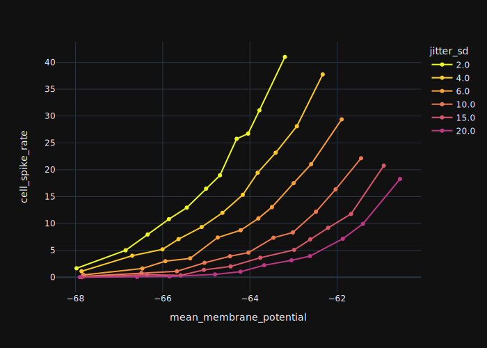
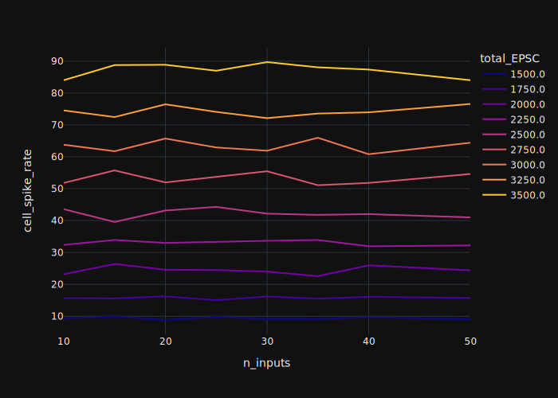
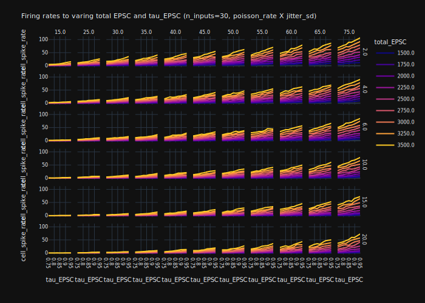
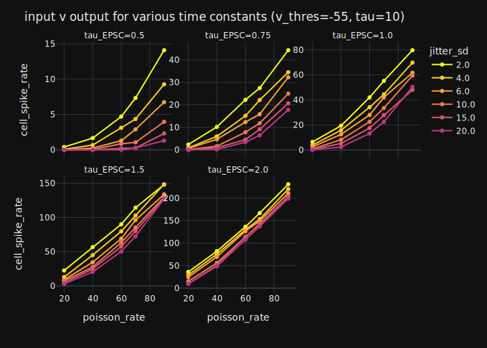
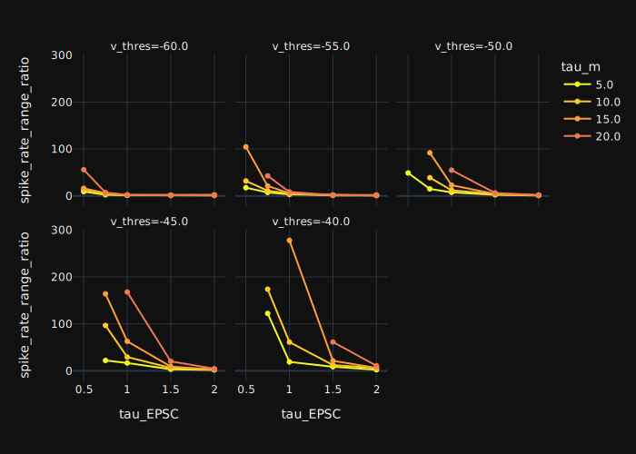
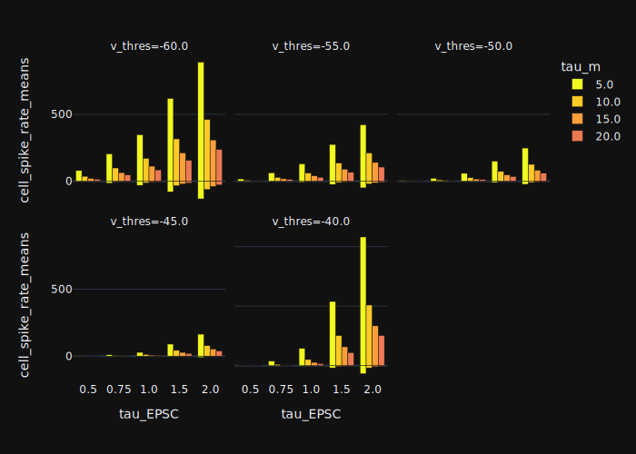
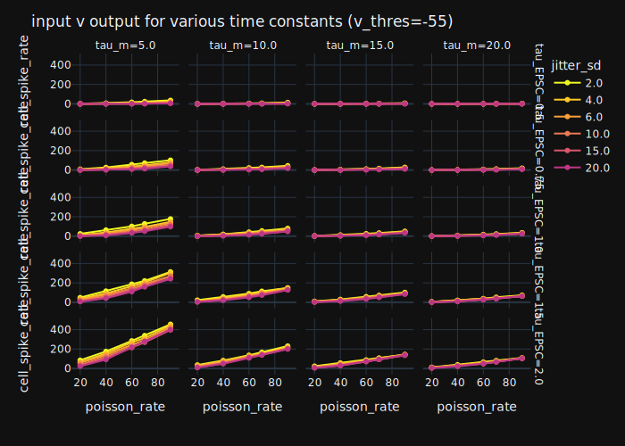
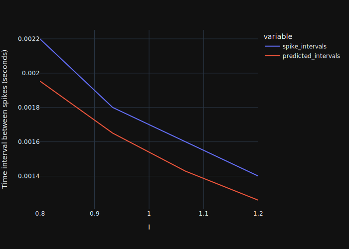
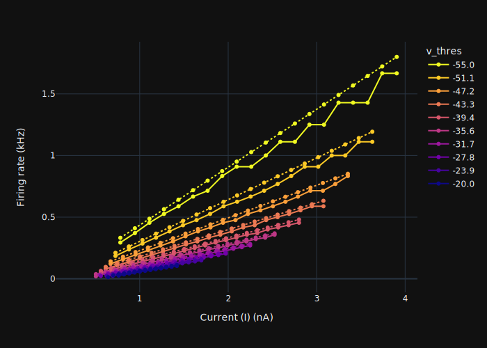

**Characterising the Stanley et al (2012) model more fully to appreciate what parameters do what,
and, especially, what parameters interact with the degree of synchrony.**


## Env vars and utilities

```python
import os

GLOBAL_ENV_VARS = {
    'WRITE_FIG': True,  # whether to write new figures
    'SHOW_FIG': False,  # whether to show new figures
    'RUN_LONG': False,  # whether to run long tasks
}

print('***\nSetting Env Variables\n***\n')
for GEV, DEFAULT_VALUE in GLOBAL_ENV_VARS.items():
    runtime_value = os.environ.get(GEV)  # defaults to None
    # parse strings into booleans, but only if actual value provided
    if runtime_value:
        new_value = (
                True
                    if runtime_value == "True"
                    else False
                )
    # if none provided, just take default value
    else:
        new_value = DEFAULT_VALUE
    print(f'Setting {GEV:<10} ... from {str(DEFAULT_VALUE):<5} to {str(new_value):<5} (runtime value: {runtime_value})')
    GLOBAL_ENV_VARS[GEV] = new_value

def show_fig(fig):
    if GLOBAL_ENV_VARS['SHOW_FIG']:
        fig.show()

def write_fig(fig, file_name: str, **kwargs):
    if GLOBAL_ENV_VARS['WRITE_FIG']:
        fig.write_image(file_name, **kwargs)
```

## Imports

```python
from dataclasses import dataclass

from typing import Union
import itertools
import pickle

import numpy as np
import pandas as pd
import brian2 as bn
from brian2 import (
    units as bnun,
    Network,
    defaultclock,
    PoissonGroup,
    PoissonInput
)
from brian2.equations.equations import parse_string_equations

import plotly.express as px
import plotly.graph_objects as go
import plotly.subplots as psp
import plotly.io as pio

from lif import settings
```

## Effect of time constants on Membrane Potential Changes


### Membrane Time Constant


...


### Synaptic Time Constant


...


## Parameter Sweeping


### Functions


These have been altered to run multiple simulations simultaneously, each differing only
in the poissonic inputs (and their synchronous clones) that are provided in each simulation.
That is, because poissonic spiking is stochastic and was previously repeated `50` times
to take averages, previous simulations were slow.  Here, in the functions below, these `50`
poissonic inputs are generated all at once, and `50` simulations, one for each set of poissonic
spikes, are run all at once.


The way that `Brian` works is such that this runs almost as quickly as running only one simulation.
Being `50` times faster, we can now do some decent parameter sweeping.

```python
def mk_multi_core_params(
        n_iters: int=50, n_inputs: int=50, jitter_sd: float=0.002, poisson_rate: float=50,
        jitter_buffer: float=0.1, run_time: float=1
        ):
    return {
        'n_iters': n_iters,
        'n_inputs': n_inputs,
        'jitter_sd': jitter_sd * bnun.second,
        'poisson_rate': poisson_rate * bnun.Hz,
        'jitter_buffer': jitter_buffer * bnun.second,
        'run_time': run_time * bnun.second
    }

def mk_multi_poisson_input(core_params: dict):

    n_iters = core_params['n_iters']

    psn_inpt = PoissonGroup(n_iters, core_params['poisson_rate'])
    psn_inpt_spikes_mnt = bn.SpikeMonitor(psn_inpt)
    ntwk = Network([psn_inpt, psn_inpt_spikes_mnt])

    ntwk.run(core_params['run_time'])

    psn_inpt_spikes = psn_inpt_spikes_mnt.spike_trains()

    return psn_inpt_spikes


def mk_multi_multiple_synchronous_poisson_inputs(
        all_psn_spikes: dict, core_params
        ):

    (jitter_sd, n_inputs, jitter_buffer) = (core_params[p] for p in
        ['jitter_sd', 'n_inputs', 'jitter_buffer']
        )

    jittered_psn_spikes = {}
    for key, psn_spikes in all_psn_spikes.items():

        jitter = (
            np.random.normal(
                loc=0, scale=jitter_sd,
                size=(n_inputs, psn_spikes.size)
                )
            * bnun.second
            )
        psn_spikes_w_jitter = (jitter + psn_spikes) + jitter_buffer
        # rectify any negative to zero
        # really shouldn't be any or many at all with the buffer
        psn_spikes_w_jitter[psn_spikes_w_jitter<0] = 0
        # sort spikes within each neuron
        psn_spikes_w_jitter = np.sort(psn_spikes_w_jitter, axis=1)

        jittered_psn_spikes[key] = psn_spikes_w_jitter

    return jittered_psn_spikes


# same as single sim version ... wrapped in new function to make multi_sim
def mk_spike_index_arrays_for_spike_generator(
        all_psn_inpt_spikes, core_params):

    (n_inputs,) = (
        core_params[p] for p in
        ['n_inputs']
        )
    n_spikes_per_input = all_psn_inpt_spikes.shape[1]
    # intervals correspond to spike `1` (second spike) to the end
    spike_idxs = np.r_[
            [
                # subtract 1 as to match interval and start from second spike
                (np.ones(n_spikes_per_input-1) * i)
                for i in range(n_inputs)
            ]
        ]

    spk_intvl = np.abs(all_psn_inpt_spikes[:, 1:] - all_psn_inpt_spikes[:, 0:-1])
    spk_intvl_within_dt_idx = (spk_intvl <= (defaultclock.dt))
    n_spikes_within_dt = np.sum(spk_intvl_within_dt_idx)

    # exclude the first spike from masking, as always included
    spks_flat_without_multi = np.r_[
        all_psn_inpt_spikes[:, 0],
        all_psn_inpt_spikes[:,1:][~spk_intvl_within_dt_idx]
        ]

    # check that total spikes is right amount
    assert (
        (all_psn_inpt_spikes.flatten().shape - n_spikes_within_dt)
        ==
        spks_flat_without_multi.shape
        )

    spks_idxs_flat = np.r_[
        np.arange(n_inputs),  # index for all the first spikes
        spike_idxs[~spk_intvl_within_dt_idx]  # already excludes the first spikes
    ]

    # sort
    input_spks_sorted_args = spks_flat_without_multi.argsort()
    input_spks_sorted = spks_flat_without_multi[input_spks_sorted_args]
    input_spks_idxs = spks_idxs_flat[input_spks_sorted_args]

    return n_spikes_within_dt, input_spks_idxs, input_spks_sorted

def mk_multi_spike_index_arrays_for_spike_generator(
        all_multi_input_spks: dict, core_params
        ):

    input_spike_data = {}
    for key, single_iter_input_spikes in all_multi_input_spks.items():
        n_w_dt, input_idxs, input_spks = mk_spike_index_arrays_for_spike_generator(
                                            single_iter_input_spikes,
                                            core_params)
        input_spike_data[key] = {
            'n_spikes_within_dt': n_w_dt,
            'inputs_spikes_idxs': input_idxs,
            'input_spikes': input_spks
        }


    all_input_spikes = np.r_[tuple(d['input_spikes'] for d in input_spike_data.values())]
    all_input_idxs = np.r_[tuple(
        d['inputs_spikes_idxs'] + (n_iter * core_params['n_inputs'])
            for n_iter, d in input_spike_data.items()
        )]
    sort_by_spike_time_idxs = np.argsort(all_input_spikes)


    return (
        input_spike_data,
        all_input_idxs[sort_by_spike_time_idxs],
        all_input_spikes[sort_by_spike_time_idxs]
        )


# same as single sim version
def mk_simulation_params(
        v_rest=-70,
        tau_m=10,
        v_thres=-55,
        v_reset=-65,
        EPSC=0.05,
        tau_EPSC=0.85,
        g_EPSC=14.2
        ):

    return {
        'v_rest': v_rest * bnun.mV,
        'tau_m': tau_m * bnun.msecond,
        'v_thres': v_thres * bnun.mV,
        'v_reset': v_reset * bnun.mV,
        'EPSC': EPSC * bnun.nA,
        'tau_EPSC': tau_EPSC * bnun.msecond,
        'g_EPSC': g_EPSC * bnun.nsiemens,
    }


def mk_multi_simulation(
        sim_params, input_spks_idxs, input_spks_sorted, core_params
        ):

    (n_inputs, n_iters) = (
        core_params[p] for p in
        ['n_inputs', 'n_iters']
        )

    total_inputs = (n_inputs * n_iters)

    # equations
    eqs = '''
    dv/dt = (v_rest - v + (I/g_EPSC))/tau_m : volt
    dI/dt = -I/tau_EPSC : amp
    '''

    on_pre =    'I += EPSC'
    threshold = 'v>v_thres'
    reset =     'v = v_reset'

    G = bn.NeuronGroup(
        n_iters, eqs,
        threshold=threshold, reset=reset,
        namespace=sim_params,
        method='euler')

    # custom spike inputs
    PS = bn.SpikeGeneratorGroup(
        total_inputs,
        input_spks_idxs,
        input_spks_sorted*bnun.second, sorted=True)

    S = bn.Synapses(PS, G, on_pre=on_pre, namespace=sim_params)
    v1_synapse_idx = np.r_[tuple(np.ones(n_inputs, dtype=int)*n for n in range(n_iters))]
    S.connect(
        i=np.arange(total_inputs),
        j=v1_synapse_idx
        )

    M = bn.StateMonitor(G, 'v', record=True)
    SM = bn.SpikeMonitor(G)

    IM = bn.StateMonitor(G, 'I', record=True)
    ntwk = Network([G, PS, S, M, IM, SM])
    ntwk.store('initial')

    return M, IM, SM, PS, ntwk

def update_multi_spike_generator(
        ntwk, input_spike_group, core_params
        ):
    ntwk.restore('initial')
    psn_spikes = mk_multi_poisson_input(core_params)
    all_psn_spks = mk_multi_multiple_synchronous_poisson_inputs(psn_spikes, core_params)
    n_dropped_spks, input_spk_idxs, input_spk_times = (
        mk_multi_spike_index_arrays_for_spike_generator(all_psn_spks, core_params)
        )

    input_spike_group.set_spikes(
            indices=input_spk_idxs,
            times=input_spk_times*bnun.second,
            sorted=True)

    return n_dropped_spks, all_psn_spks, input_spk_idxs, input_spk_times, ntwk

def multi_simulation_averages(
        v_mon, spike_mon, input_spike_data, core_params, sim_params
        ):

    (n_iters, n_inputs, jitter_buffer, run_time) = (
        core_params[p] for p in
        ['n_iters', 'n_inputs', 'jitter_buffer', 'run_time']
        )

    total_inputs=(n_iters*n_inputs)
    time_idxs_past_jitter_buffer = v_mon.t > jitter_buffer

    sim_averages = [
        {
            'input_spike_rate': len(input_spike_data[i]['input_spikes']) / n_inputs / run_time,
            'cell_spike_rate': (
                len(spike_mon.all_values()['t'][i][
                        spike_mon.all_values()['t'][i]>(jitter_buffer)
                    ]
                    )
                / run_time
                ),
            'mean_membrane_potential': np.mean(v_mon.v[i][time_idxs_past_jitter_buffer]),
            'n_dropped_spks': input_spike_data[i]['n_spikes_within_dt'],
            **core_params,
            **sim_params
        }

        for i in range(n_iters)
    ]

    return sim_averages

    # input_spike_rates = {}
    # for i, data in input_spike_data.items():
    #     input_spike_rate = len(data['input_spikes']) / n_inputs / run_time
    #     input_spike_rates[i] = input_spike_rate

    # cell_spike_rates = {}
    # for i, spike_times in spike_mon.all_values()['t'].items():
    #     cell_spike_rate = len(spike_times[spike_times>(jitter_buffer)]) / run_time
    #     cell_spike_rates[i] = cell_spike_rate

    # time_idxs_past_jitter_buffer = v_mon.t > jitter_buffer
    # mean_membrane_potentials = {}
    # for i in range(n_iters):
    #     mean_membrane_potential = np.mean(v_mon.v[i][time_idxs_past_jitter_buffer])
    #     mean_membrane_potentials[i] = mean_membrane_potential

    # return input_spike_rates, mean_membrane_potentials, cell_spike_rates

def plot_cell_membrane_spikes(v_mon, spike_mon):

    spike_times = spike_mon.all_values()['t'][0]
    fig = (
        px
        .line(x=v_mon.t/bnun.ms, y=v_mon.v[0])
        .add_scatter(
            x=spike_times / bnun.ms, y=np.ones_like(spike_times)*sim_params['v_thres'],
            mode='markers', name='spikes')
        .add_shape(type='line', x0=100, x1=100, y0=0, y1=1, yref='paper', line_dash='dot')
    )
    return fig

def plot_test_spike(v_mon, i_mon, test_spike_time):

    fig = (
        psp
        .make_subplots(
            rows=2, cols=1, shared_xaxes=True,
            x_title='Time (ms)'
            )
        .add_scatter(
            row=1, col=1,
            # name='Current',
            mode='lines',
            x=i_mon.t/bnun.ms, y=i_mon.I[0],
            )
        .add_scatter(
            row=2, col=1,
            # name='Potential',
            mode='lines',
            x=v_mon.t/bnun.ms, y=v_mon.v[0],
            )
        .update_yaxes(
            row=2,
            range=[
                sim_params['v_rest'],
                np.max(v_mon.v[0][v_mon.t > (test_spike_time*bnun.second)]),
                ]
            )
        .update_layout(
            title=f'Test Spike (at {test_spike_time*bnun.second/bnun.msecond} ms)',
            showlegend=False,
            yaxis_title='Synaptic Current (Amperes)',
            yaxis2_title='Membrane Potential (Volts)'
            )
        )
    return fig


def run_multi_simulations(
        core_params,
        sim_params,
        ):

    psn_spikes = mk_multi_poisson_input(core_params)
    all_psn_spks = mk_multi_multiple_synchronous_poisson_inputs(psn_spikes, core_params)

    input_spike_data, input_spk_idxs, input_spk_times = (
        mk_multi_spike_index_arrays_for_spike_generator(all_psn_spks, core_params)
        )
    v_mon, i_mon, spike_mon, input_spike_group, ntwk = mk_multi_simulation(
        sim_params, input_spk_idxs, input_spk_times, core_params)

    ntwk.run(core_params['run_time']+core_params['jitter_buffer'])

    sim_averages = multi_simulation_averages(
        v_mon, spike_mon, input_spike_data, core_params, sim_params)

    # input_spike_rates, mean_membrane_potential, cell_spike_rates = (
    #     multi_simulation_averages(v_mon, spike_mon, input_spike_times, core_params)
    #     )

    # check length of averages all the same
    assert len(sim_averages) == core_params['n_iters']

    return sim_averages


def update_sim_vars(core_params, sim_params, sim_vars, sim_var_meta_data):

    for meta_data, sim_var in zip(sim_var_meta_data, sim_vars):
        meta_data[0][meta_data[1]] = sim_var

    return core_params, sim_params
```

```python
# ### Basic Test Runs
```
```python
# Step by step
if GLOBAL_ENV_VARS['RUN_LONG']:
    core_params = mk_multi_core_params(n_iters=10, n_inputs=50)
    psn_spikes = mk_multi_poisson_input(core_params)
    all_psn_spks = mk_multi_multiple_synchronous_poisson_inputs(psn_spikes, core_params)

    input_spike_data, input_spk_idxs, input_spk_times = (
        mk_multi_spike_index_arrays_for_spike_generator(all_psn_spks, core_params)
        )
    sim_params = mk_simulation_params()
    v_mon, i_mon, spike_mon, input_spike_group, ntwk = mk_multi_simulation(
        sim_params, input_spk_idxs, input_spk_times, core_params)

    ntwk.run(core_params['run_time']+core_params['jitter_buffer'])
    sim_avgs = multi_simulation_averages(
        v_mon, spike_mon, input_spike_data, core_params, sim_params
        )
```

```python
if GLOBAL_ENV_VARS['RUN_LONG']:
    # with wrapper function
    core_params = mk_multi_core_params(n_iters=50, n_inputs=50)
    sim_params = mk_simulation_params()

    sim_values = run_multi_simulations(core_params, sim_params)
```
```python

```


### Sweep 1: Scaling the number of inputs


The original model had 50 inputs.  This is unrealistically high for V1.  So, how scale down?
Can the total amount of synaptic current (ie, `n_inputs * EPSC`) stay constant so that
`n_inputs` and `EPSC` scale linearly with each other?


Here, the poisson input rate and jitter variables are swept through while also varying
the number of inputs and the synaptic parameters: `EPSC` current and `tau_EPSC` time constant.


**Due to the high number of parameters, this simulation takes many hours!!**

```python
if GLOBAL_ENV_VARS['RUN_LONG']:
    n_iters = 50  # repeats for each condition
    n_inputs = 50

    core_params = mk_multi_core_params(n_iters=n_iters, n_inputs=n_inputs)
    sim_params = mk_simulation_params()

    # metadata for all values listed below
    sim_var_meta_data = (
        (core_params, 'poisson_rate'),
        (core_params, 'jitter_sd'),
        (core_params, 'n_inputs'),
        (sim_params, 'EPSC'),
        (sim_params, 'tau_EPSC')
        )

    poisson_rates = [pr*bnun.hertz for pr in (15, 25, 30, 35, 40, 45, 50, 55, 60, 65, 75)]  # Hertz
    jitter_sd_vals = [j/1000*bnun.second for j in (2, 4, 6, 10, 15, 20)]  # seconds!!
    n_input_vals = [10, 15, 20, 25, 30, 35, 40, 50]
    epsc_vals = [epsc * bnun.nA for epsc in (1.5, 1.75, 2, 2.25, 2.5, 2.75, 3, 3.25, 3.5)]  # total current for all inputs
    epsc_tau_vals = [tau * bnun.msecond for tau in (0.75, 0.80, 0.825, 0.85, 0.875, 0.9, 0.95)]

    # all combinations of parameters
    all_sim_vars = list(itertools.product(
        poisson_rates,
        jitter_sd_vals,
        n_input_vals,
        epsc_vals,
        epsc_tau_vals
        ))

    all_sim_vars[:5]

    # transform epsc_vals from total to EPSC per synapse
    all_sim_vars = list(map(lambda sv: (*sv[:3], sv[3]/sv[2], *sv[4:]), all_sim_vars))

    sim_data = []

    for i, sim_vars in enumerate(all_sim_vars):
        print(f'{i:>4} of {len(all_sim_vars)} ({i/len(all_sim_vars):.2%})', end='\r')
        core_params, sim_params = update_sim_vars(
            core_params, sim_params, sim_vars, sim_var_meta_data)
        sim_values = run_multi_simulations(core_params, sim_params)
        sim_data.extend(sim_values)
```

#### Save and Clean Sim Data

```python
if GLOBAL_ENV_VARS['RUN_LONG']:
    data = pd.DataFrame(sim_data)
    data.head()

    # remove units from data to create floating/integer/numeric data types (not quantity object)
    col_unit_data = {}
    for col in data.columns:
        if isinstance(data[col][0], bnun.Quantity):
            print(f'{col:<40} is a quantity')
            # just use first value
            base_unit = data[col][0].get_best_unit()
            data[col] = [(v/base_unit) for v in data[col]]
            col_unit_data[col] = base_unit
        else:
            print(f'{col:<40} is NOT a quantity')


    data_dir = settings.get_data_dir()
    data.to_parquet(data_dir / 'stanley_2012_homogenous_poisson_param_sweep.parquet')

    col_unit_data_df = pd.Series(col_unit_data)
    col_unit_data_df.to_pickle(
        data_dir/ 'stanley_2012_homogenous_poisson_param_sweep_col_unit_data.pkl')

else:
    data_dir = settings.get_data_dir()
    data = pd.read_parquet(data_dir / 'stanley_2012_homogenous_poisson_param_sweep.parquet')
    col_unit_data_df = pd.read_pickle(
        data_dir/ 'stanley_2012_homogenous_poisson_param_sweep_col_unit_data.pkl')


# total synaptic current
# florating point error plagues this data ... round to remove
data['total_EPSC'] = np.round(data['EPSC'] * data['n_inputs'], 3)


# Check floating point ERROR
for v in data['total_EPSC'].unique():
    print(v)
```

#### Analyse


##### Membrane potential v output rate


Checking that membrane potential v output rate looks like previous characterisation.
Looks good!

```python
base_n_input = 50
base_epsc = 2500 # in picoamps and for total_EPSC
base_tau_epsc = 0.85

data_base_subset = data.query(
    'n_inputs == @base_n_input and total_EPSC == @base_epsc and tau_EPSC == @base_tau_epsc')

group_means = (
    data_base_subset
    .groupby(['jitter_sd', 'poisson_rate'])
    .mean()
    .reset_index()
    )

fig = (
    px
    .line(
        group_means,
        x='mean_membrane_potential', y='cell_spike_rate',
        color='jitter_sd',
        color_discrete_sequence=px.colors.sequential.Plasma_r
    )
    .update_traces(mode='lines+markers')
)
```
```python
show_fig(fig)
write_fig(
    fig.update_layout(template='plotly_dark'),
    'stanley_2012_pt2_potential_v_firing_rate_avgs.svg')
```



```python

```

##### Scaling with the number of inputs


Looking to see what happens when the number of inputs are altered but the total amount
of `EPSC` is kept constant.

```python
jitter_val = 2
poission_rate_val = 75
base_tau_epsc = 0.85


inputs_epsc = (
    data
    .query(
        'jitter_sd==@jitter_val and poisson_rate==@poission_rate_val and tau_EPSC==@base_tau_epsc'
        )
    .groupby(['n_inputs', 'total_EPSC'])
    ['cell_spike_rate']
    .mean()
)
```
```python
fig = (
    px
    .line(
        inputs_epsc.reset_index(),
        x='n_inputs', y='cell_spike_rate',
        color='total_EPSC',
        color_discrete_sequence=px.colors.sequential.Plasma
        )
)
```
```python
show_fig(fig)
write_fig(
    fig.update_layout(template='plotly_dark'),
    'stanley_2012_pt2_n_inputs_v_output_rate_by_total_EPSC.svg')
```




On average, the number of inputs seems to have no effect on the output firing rate, while
total_EPSC has a pretty clean and linear effect that holds constant across all the `n_inputs`
values.


Looking now at whether the input rate or degree of synchrony have any interactions ...

```python
inputs_epsc_full = (
    data
    .groupby([
        'tau_EPSC',
        'total_EPSC',
        'n_inputs',
        'jitter_sd',
        'poisson_rate'
        ])
    .mean()
    .reset_index()
)
```

```python
base_tau_epsc=0.85

fig = (
    px
    .line(
        inputs_epsc_full.query('tau_EPSC==@base_tau_epsc'),
        x='n_inputs', y='cell_spike_rate',
        color='total_EPSC', color_discrete_sequence=px.colors.sequential.Plasma,
        facet_col='poisson_rate',
        facet_row='jitter_sd'
        )
    .update_layout(font_size=8)
    .for_each_annotation(lambda a: a.update(text=a.text.split("=")[1]))
    .update_layout(
    title=f'Firing rates to varing total EPSC (tau_EPSC={base_tau_epsc}, poisson_rate X jitter_sd)')
)
```
```python
show_fig(fig)
write_fig(
    fig.update_layout(template='plotly_dark', font_size=7),
    'stanley_2012_pt2_n_inputs_v_output_rate_by_EPSC_scales_linearly_across_vars.svg',
    )
```


Looking at the data with `tau_EPSC` on the `x axes` to see what interaction the synaptic
time constant has.

```python
base_n_inputs = 30
fig = (
    px
    .line(
        inputs_epsc_full.query('n_inputs==@base_n_inputs'),
        x='tau_EPSC', y='cell_spike_rate',
        color='total_EPSC', color_discrete_sequence=px.colors.sequential.Plasma,
        facet_col='poisson_rate',
        facet_row='jitter_sd'
        )
    .update_layout(font_size=8)
    .for_each_annotation(lambda a: a.update(text=a.text.split("=")[1]))
    .update_layout(
    title=f'Firing rates to varing total EPSC and tau_EPSC (n_inputs={base_n_inputs}, poisson_rate X jitter_sd)')
)
```
```python
show_fig(fig)
write_fig(
    fig.update_layout(template='plotly_dark'),
    'stanley_2012_pt2_tau_EPSC_v_output_rate_by_total_EPSC_and_input_and_synchrony.svg')
```




There seems to be some exponentiation with increasing `tau_EPSC`, which makes sense as this
is the rate of decay which should exponentially lead to greater amounts of current as the decay
gets linearly slower.


Looking now at the exponentiation of synchronous inputs for different `n_inputs`
and `total_EPSC` ...

```python
base_tau_epsc=0.85
fig = (
    px
    .line(
        inputs_epsc_full
            .query('tau_EPSC==@base_tau_epsc')
            .query(
                'n_inputs.isin([10, 30, 50]) and total_EPSC.isin([1500, 2000, 2500, 3000, 3500])')
        ,
        x='poisson_rate',
        y='cell_spike_rate',
        color='jitter_sd', color_discrete_sequence=px.colors.sequential.Plasma_r,
        facet_row='n_inputs',
        facet_col='total_EPSC'
        )
    )
```
```python
show_fig(fig)
write_fig(
    fig.update_layout(template='plotly_dark'),
    'stanley_2012_pt2_exponential_output_from_synchrony_over_total_EPSC_and_n_inputs.svg')
```


Here we see that the magnitude of the exponentiation that synchrony generates depends on the
total `EPSC`, IE, the total amount of current generally being injected into the model, and is not
affected by the number of inputs (`n_inputs`) it seems.


*Though*, there does seem to be a small degree of facilitation of increased output in the lower
synchrony (higher `jitter_sd` values) when there are fewer `n_inputs` (compare `10` to `50`).
This makes sense, as with fewer inputs and larger jitter, the smaller number of inputs means that
the large jitter has "fewer" chances to be noisy, and more chances of landing a few spikes within
a narrow time window, which, having a relatively large share of the total `EPSC` current, will
deliver a relatively high `EPSP`.


Looking now at any interaction between `total_EPSC` and `tau_EPSC` on the degree of synchrony
driven exponentiation ...

```python
base_n_inputs = 30
total_EPSC_vals = [1500, 2000, 2500, 3000, 3500]
tau_EPSC_vals = [0.75, 0.85, 0.95]
fig = (
    px
    .line(
        inputs_epsc_full.query('n_inputs==@base_n_inputs')
        .query(
            'total_EPSC.isin(@total_EPSC_vals) and tau_EPSC.isin(@tau_EPSC_vals)')
        ,
        x='poisson_rate',
        y='cell_spike_rate',
        color='jitter_sd', color_discrete_sequence=px.colors.sequential.Plasma_r,
        facet_row='tau_EPSC',
        facet_col='total_EPSC'
        )
    .update_layout(title='Input output exponentiation by synchrony by synaptic strengh and time constant')
    )
```
```python
show_fig(fig)
write_fig(
    fig.update_layout(template='plotly_dark'),
    'stanley_2012_pt2_exponentiation_from_synchrony_by_EPSC_and_tau_EPSC_with_fixed_n_inputs.svg')
```


Here we can see that the `total_EPSC` seems to simply increase the amplitude of the exponential
curves.  The time constant `tau_EPSC` also increases this amplitude, but also seems to reduce
the amount of exponentiation and instead makes the output curves more linear.
See below [section on how `tau_EPSC` disrupts synchrony exponentiation](#epsc-time-constant-controls-effect-of-synchrony).


### Sweep 2: Additional Parameter sweep focusing on synchrony


Idea is to focus on the parameters that interact most strongly with synchrony
and the exponentiation of output firing rates.


#### Simulation Code

```python
if GLOBAL_ENV_VARS['RUN_LONG']:
    n_iters = 50  # repeats for each condition
    n_inputs=50

    core_params = mk_multi_core_params(n_iters=n_iters, n_inputs=n_inputs)
    sim_params = mk_simulation_params()

    # metadata for all values listed below
    sim_var_meta_data = (
        (core_params, 'poisson_rate'),
        (core_params, 'jitter_sd'),
        (sim_params, 'v_thres'),
        (sim_params, 'tau_EPSC'),
        (sim_params, 'tau_m'),
        )

    poisson_rates = [pr*bnun.hertz for pr in (20, 40, 60, 70, 90)]  # Hertz
    jitter_sd_vals = [j/1000*bnun.second for j in (2, 4, 6, 10, 15, 20)]  # seconds!!
    v_thres_vals = [vt*bnun.mV for vt in (-60, -55, -50, -45, -40)]
    epsc_tau_vals = [tau * bnun.msecond for tau in (0.5, 0.75, 1, 1.5, 2)]
    # epsc_tau_vals = [tau * bnun.msecond for tau in (0.75, 0.80, 0.825, 0.85, 0.875, 0.9, 0.95)]
    tau_vals = [tau * bnun.msecond for tau in (5, 10, 15, 20)]

    # all combinations of parameters
    all_sim_vars = list(itertools.product(
        poisson_rates,
        jitter_sd_vals,
        v_thres_vals,
        epsc_tau_vals,
        tau_vals,
    ))

    print(all_sim_vars[:2])
    print(f'Estimates Hours: {len(all_sim_vars) * 1.2 / 3600}')

    sim_data = []

    for i, sim_vars in enumerate(all_sim_vars):
        print(f'{i:>4} of {len(all_sim_vars)} ({i/len(all_sim_vars):.2%})', end='\r')
        core_params, sim_params = update_sim_vars(
            core_params, sim_params, sim_vars, sim_var_meta_data)
        sim_values = run_multi_simulations(core_params, sim_params)
        sim_data.extend(sim_values)
```

#### Clean, Save and Load

```python
if GLOBAL_ENV_VARS['RUN_LONG']:
    sim_data_df = pd.DataFrame(sim_data)
    print(sim_data_df.head(2).T)
    print(sim_data_df.shape)


    col_unit_data = {}
    for col in sim_data_df.columns:
        if isinstance(sim_data_df[col][0], bnun.Quantity):
            print(f'{col:<40} is a quantity')
            # just use first value
            base_unit = sim_data_df[col][0].get_best_unit()
            sim_data_df[col] = [(v/base_unit) for v in sim_data_df[col]]
            col_unit_data[col] = base_unit
        else:
            print(f'{col:<40} is NOT a quantity')

    sim_data_df.to_parquet(
        settings.get_data_dir() /
        'stanley_2012_homogenous_poisson_param_sweep_synchrony_focused_params.parquet')

    col_unit_data_df = pd.Series(col_unit_data)
    col_unit_data_df.to_pickle(
        settings.get_data_dir()
        / 'stanley_2012_homogenous_poisson_param_sweep_synchrony_focused_params_col_units.pkl')

else:
    sim_data_df = pd.read_parquet(
        settings.get_data_dir() /
        'stanley_2012_homogenous_poisson_param_sweep_synchrony_focused_params.parquet')

    col_unit_data_df = pd.read_pickle(
        settings.get_data_dir()
        / 'stanley_2012_homogenous_poisson_param_sweep_synchrony_focused_params_col_units.pkl')

```


#### Analyse


##### Basic Check of exponentiation with synchrony

```python
group_means = (
    sim_data_df.query(
        'v_thres==-55 and tau_EPSC==0.75 and tau_m==10')
    .groupby([
        'jitter_sd', 'poisson_rate'
        ])
    .mean()
    .reset_index()
    )
```
```python
fig = (
    px
    .line(
        group_means,
        x='poisson_rate', y='cell_spike_rate',
        color='jitter_sd', color_discrete_sequence=px.colors.sequential.Plasma_r,
        )
    .update_traces(mode='lines+markers')
    )
```
```python
show_fig(fig)
write_fig(
    fig.update_layout(template='plotly_dark'),
    'stanley_2012_pt2_synchrony_sweep_base_input_v_output.svg')
```


##### Effect of the Time Constants


Generally, longer synaptic time constants (`tau_EPSC`) lead to higher firing rates,
and, *shorter* membrane time constants (`tau_m`) similarly lead to higher firing rates.

```python
fig = (
    px
    .line(
        (
            sim_data_df
            .groupby(
                ['tau_m', 'poisson_rate', 'tau_EPSC'])
            [['cell_spike_rate']]
            .mean()
            .reset_index()
        ),
        x='poisson_rate', y='cell_spike_rate',
        color='tau_EPSC',
        color_discrete_sequence=px.colors.sequential.Plasma_r,
        facet_col='tau_m', facet_col_wrap=2
        )
    )
```
```python
show_fig(fig)
write_fig(
    fig.update_layout(template='plotly_dark'),
    'stanley_2012_pt2_time_constant_output_rate.svg')
```


###### EPSC Time Constant controls effect of synchrony


**BUT ... Long synaptic time constants destroy the output facilitation effect of synchrony**.
This makes sense.  Longer time constants means stretched out `EPSPs` which means that the
synchrony of input spikes matters less and the window of efficacy broadens with the stretching
of the EPSP over time.

```python
v_thres_value = -55
poisson_means = (
    sim_data_df.query('v_thres==@v_thres_value')
    .groupby([
        'jitter_sd', 'poisson_rate',
        'tau_m', 'tau_EPSC'])
    .mean()
    .reset_index()
    )
```
```python
tau_m_value = 10
fig = (
    px
    .line(
        poisson_means.query('tau_m==@tau_m_value'),
        x='poisson_rate', y='cell_spike_rate',
        color='jitter_sd', color_discrete_sequence=px.colors.sequential.Plasma_r,
        facet_col='tau_EPSC', facet_col_wrap=3
        )
    .update_traces(mode='lines+markers')
    .update_layout(
    title=f'input v output for various time constants (v_thres={v_thres_value}, tau={tau_m_value})')
    )
```
```python
show_fig(fig)
write_fig(
    fig.update_layout(template='plotly_dark'),
    'stanley_2012_pt2_synchrony_focused_membrane_time_constant_effect_input_output.svg')
```


Now with independent y-axes so that the different degrees of exponentiation will be more clear

```python
fig = fig.update_yaxes(matches=None, showticklabels=True)
```
```python
show_fig(fig)
write_fig(
    fig.update_layout(template='plotly_dark'),
    'stanley_2012_pt2_synchrony_focused_membrane_time_constant_effect_input_output_independent_y_axes.svg')
```




###### Quantifying the degree of exponentiation


The general effect of greater synchrony is to increase the exponentiation of output with increasing
input rates.  We can capture this effect numerically as the absolute range in output
(`cell firing rates`), across all `jitter_sd` (ie, synchrony) values for the same input rate.
With exponentiation, the range should get larger with larger inputs as the more synchronous
inputs driver greater and greater output.
Taking the ratio of the range for the greatest input rate with that of the lowest input rate,
we measure the degree of exponentiation, where larger ratios indicate more exponentiation

```python
# take only min and max input rates
input_min, input_max = poisson_means.poisson_rate.min(), poisson_means.poisson_rate.max()

# take means of each poisson run (same poisson rate repeated to get stable averages)
group_means = (
    sim_data_df
    # take only min and max input rates
    .loc[sim_data_df.poisson_rate.isin([input_min, input_max])]
    .groupby([
        'v_thres',
        'tau_m',
        'tau_EPSC',
        'poisson_rate',
        'jitter_sd',
        ])
    [['cell_spike_rate']]
    .mean()
    )
# group_means.head()

output_rates_range_ratios = (
    group_means
    # .set_index(['tau_m', 'tau_EPSC', 'jitter_sd', 'poisson_rate'])[['cell_spike_rate']]
    # for all jitter_sd values
    .groupby(level=['v_thres', 'tau_m', 'tau_EPSC', 'poisson_rate'])
    # find range of outputs
    .apply(lambda grp: (grp.max()-grp.min()))
    # then for each time constant configuration
    .groupby(level=['v_thres', 'tau_m','tau_EPSC'])
    # find ratio of ranges (between low and high input)
    .apply(lambda grp: grp.max()/grp.min())
    .rename(columns={'cell_spike_rate':'spike_rate_range_ratio'})
)
```
```python
fig = (
    px
    .line(
        output_rates_range_ratios.reset_index(),
        x='tau_EPSC', y='spike_rate_range_ratio',
        color='tau_m', color_discrete_sequence=px.colors.sequential.Plasma_r,
        facet_col='v_thres', facet_col_wrap=3
        )
    .update_traces(mode='lines+markers')
    )
```
```python
show_fig(fig)
write_fig(
    fig.update_layout(template='plotly_dark'),
    'stanley_2012_pt2_output_range_over_jitter_by_threshold_and_time_constants.svg')
```




Values are missing because they are `infinity`, being ratios, this is caused by output firing rates
at low input all being zero no matter how much synchrony.  The range for these values is then also
zero, and so the ratio is infinite.


Generally though, the pattern is pretty clear.  The effect of higher threshold values is more
pronounced as higher thresholds make it harder to spike and suppress firing to zero at lower
inputs.


To see how the ratios relate to absolute firing rates, here the firing rates are plotted, with
positive bars representing the output rate from the largest input rate.
Negative bars are the firing rates from the smallest input rate, where the ratios above are
the ratio of these two output firing rates.

```python
output_rate_means = (
    group_means
    .groupby(level=['v_thres', 'tau_m', 'tau_EPSC', 'poisson_rate'])
    .agg(cell_spike_rate_means = ('cell_spike_rate','mean'))
)
# output_rate_means.head()
```
```python
fig = (
    px
    .bar(
        output_rate_means
            .reset_index()
            .assign(
                tau_m=lambda df: df['tau_m'].astype(str),
                tau_EPSC=lambda df: df['tau_EPSC'].astype(str),
                cell_spike_rate_means=lambda df: (
                    df['cell_spike_rate_means'] * (df['poisson_rate']==20).map({True:-1, False:1})
                )
            )
        ,
        x='tau_EPSC', y='cell_spike_rate_means',
        color='tau_m', color_discrete_sequence=px.colors.sequential.Plasma_r,
        barmode='group',
        facet_col='v_thres',
        facet_col_wrap=3
        # facet_row='poisson_rate'
        )
    .update_yaxes(matches=None, selector=lambda ax: ax['domain'][0] == 0)
    # .update_yaxes(
    #     showticklabels=True,
    #     zeroline=True, zerolinecolor='black'
    #     )
    )
```
```python
show_fig(fig)
write_fig(
    fig.update_layout(template='plotly_dark'),
    'stanley_2012_pt2_output_range_over_jitter_by_threshold_and_time_constants_absolute_vals.svg')
```




And taking a closer look at some of the smaller values by filtering down to higher threshold
values and lower `tau_EPSC` values.

```python
fig = (
    px
    .bar(
        output_rate_means
            .query('v_thres > -60 and tau_EPSC <= 1')
            .reset_index()
            .assign(
                tau_m=lambda df: df['tau_m'].astype(str),
                tau_EPSC=lambda df: df['tau_EPSC'].astype(str),
                cell_spike_rate_means=lambda df: (
                    df['cell_spike_rate_means'] * (df['poisson_rate']==20).map({True:-1, False:1})
                )
            )
        ,
        x='tau_EPSC', y='cell_spike_rate_means',
        color='tau_m', color_discrete_sequence=px.colors.sequential.Plasma_r,
        barmode='group',
        facet_col='v_thres',
        facet_col_wrap=3
        )
    .update_yaxes(matches=None, selector=lambda ax: ax['domain'][0] == 0)
    )
```
```python
show_fig(fig)
write_fig(
    fig.update_layout(template='plotly_dark'),
    'stanley_2012_pt2_output_range_over_jitter_by_threshold_and_time_constants_absolute_vals_zoom_in.svg')
```


###### Comparing all membrane and synaptic time constants

```python
v_thres_value = -55
poisson_means = (
    sim_data_df.query('v_thres==@v_thres_value')
    .groupby([
        'jitter_sd', 'poisson_rate',
        'tau_m', 'tau_EPSC'])
    .mean()
    .reset_index()
    )

fig = (
    px
    .line(
        poisson_means,
        x='poisson_rate', y='cell_spike_rate',
        color='jitter_sd', color_discrete_sequence=px.colors.sequential.Plasma_r,
        facet_col='tau_m', facet_row='tau_EPSC'
        )
    .update_traces(mode='lines+markers')
    .update_layout(title=f'input v output for various time constants (v_thres={v_thres_value})')
    )
```
```python
show_fig(fig)
write_fig(
    fig.update_layout(template='plotly_dark'),
    'stanley_2012_pt2_synchrony_focused_time_constant_effect_input_output.svg')
```




Now, again, with independent `y-axes`:

```python
fig = fig.update_yaxes(matches=None, showticklabels=True)
```
```python
show_fig(fig)
write_fig(
    fig.update_layout(template='plotly_dark'),
    'stanley_2012_pt2_synchrony_focused_time_constant_effect_input_output_independet_y_axes.svg')
```


Higher threshold levels introduce more suppression which make the dynamics more unstable or
extreme ...

```python
v_thres_value = -40
poisson_means = (
    sim_data_df.query('v_thres==@v_thres_value')
    .groupby([
        'jitter_sd', 'poisson_rate',
        'tau_m', 'tau_EPSC'])
    .mean()
    .reset_index()
    )

fig = (
    px
    .line(
        poisson_means,
        x='poisson_rate', y='cell_spike_rate',
        color='jitter_sd', color_discrete_sequence=px.colors.sequential.Plasma_r,
        facet_col='tau_m', facet_row='tau_EPSC'
        )
    .update_traces(mode='lines+markers')
    .update_layout(title=f'input v output for various time constants (v_thres={v_thres_value})')
    )
```
```python
show_fig(fig)
write_fig(
    fig.update_layout(template='plotly_dark'),
    'stanley_2012_pt2_synchrony_focused_time_constant_effect_input_output_threshold_-40.svg')
```


And again with independent `y-axes`

```python
fig = fig.update_yaxes(matches=None, showticklabels=True)
```
```python
show_fig(fig)
write_fig(
    fig.update_layout(template='plotly_dark'),
    'stanley_2012_pt2_synchrony_focused_time_constant_effect_input_output_threshold_-40_independent_y_axes.svg')
```


### Analytical Firing Rate from Current Injection


#### Introduction


A mathematical analysis can bring insight into the results seen so far.


Sources for this analysis are:


* Koch, C. (2004). Biophysics of computation: Information processing in single neurons (1st ed.). Oxford Univ. Press.
* Gerstner, W., & Kistler, W. M. (2002). Spiking neuron models: Single neurons, populations, plasticity. Cambridge University Press. https://books.google.com.au/books?id=Rs4oc7HfxIUC


For an Integrate and Fire model of form:


```math
\frac{du}{dt} = \frac{-v(t) + RI(t)}{\tau_m}
```


Where $`I_{o}`$ is being injected constantly, the following can be said of the spiking behaviour of the neuron.


* *Presume that the voltage reset value is `0` and the spiking threshold is expressed as a delta from the reset value (ie, positive)*
    - See `Gerstner`
* The minimum current necessary to trigger a spike is given by `I_threshold = V_threshold/R`.
    - `V_threshold` is the potential at which a spike is triggered.
* The time interval (`T`) between spikes, with absolute refractory period (`Ref`) is the equation below
    - Note that `V_threshold` is presumed positive here, as a value above the reset value of `0`
    - Also note that `I0` must be greater than `I_threshold`.
* The firing rate, also known as a `strength-duration` curve (see `Koch`), is simply `Rate = 1/T`


```
T = Ref + (tau * ln((R*I0) / (R*I0 - V_threshold)))     (Gerstner)


T = Ref - tau * ln(1 - V_threshold / R*I0)              (Koch)
```


```math
\begin{split}
F_{rate} &= \frac{1}{\Delta_{abs} + \tau_{m} \ln(\frac{RI_{o}}{RI_{o} - V_{thres}})} \\
&= \frac{1}{\Delta_{abs} - \tau_{m} \ln(1 - \frac{V_{thres}}{RI_{o}})}
\end{split}
```


With:


* $`F_{rate}`$: Firing Rate
* $`\Delta_{abs}`$: Absolute refractory time
* $`\tau_{m}`$: time constant of the membrane
* $`R`$: Resistance of the synaptic input onto the membrane.


A straightforward way of understanding this equation is that the output firing rate as an essentially
linear relationship to the magnitude of the injected current ($`I_{0}`$) with the slope of this
linearity getting higher with lower spiking thresholds, lower/quicker time constants and
lower/shorter refractory periods.


#### The Equation and how it behaves


Putting the equation into a function ...

```python
def lif_current_inject_firing_rate(
        tau_m, g_EPSC, v_thres, v_reset,
        I, ref = 0, as_interval=False,
        **kwargs
        ):
    """
    g_EPSC is inverse of resistance

    T = 1 / (Ref + (tau * ln(1 - (R*I0 / V_threshold))))

    **kwargs is to allow the dumping of parameter dictionaries without
    worrying about undefined arguments
    """
    R = (1/g_EPSC)
    # presume reset is 0 and find how much above the threshold is (as a positive term)
    v_thres_norm = v_thres - v_reset

    # Gerstner with a minus instead of a plus
    # interval = ref - (tau_m * np.log(R*I / (R*I - v_thres_norm)) )
    # Gerstner with a plus (as printed)
    interval = ref + (tau_m * np.log(R*I / (R*I - v_thres_norm)) )

    # Koch
    # interval = ref - (tau_m * np.log(1 - (v_thres_norm / (R*I) )) )

    if as_interval:
        return interval
    else:
        return (1 / interval)
```

Brief demonstration of the equation ...


A key element is the calculation of `v_thres_norm`, where the equation is derived by presuming
that the value to which the membrane potential is reset after a spike is `0`.
As the reseting membrane potential is not a factor in the equation, this presumption is arbitrary.
So, to use the equation, the difference between the threshold and reset potentials is found and
used as the "*normalised*" threshold.


This is done within the function already, but done here explicitly to determine the minimal
"*threshold*" current required to trigger any spikes.


```python
tau_m =         15*bnun.msecond
conductance =   14.2*bnun.nsiemens
R  =            (1/conductance)
v_thres =       -55*bnun.mV
v_reset =       -65*bnun.mV
v_thres_norm =  v_thres - v_reset
I_thres =       v_thres_norm / R
ref =           0

I_vals = np.linspace(I_thres, I_thres + (0.1*bnun.nA), 1000)

rates = lif_current_inject_firing_rate(
    tau_m=tau_m, g_EPSC=conductance,
    v_thres=v_thres, v_reset=v_reset,
    I=I_vals, ref=ref
    )

ref2 = 3 * bnun.msecond
rates_refractory = lif_current_inject_firing_rate(
    tau_m=tau_m, g_EPSC=conductance,
    v_thres=v_thres, v_reset=v_reset,
    I=I_vals, ref=ref2
    )
```
```python
fig = (
    px
    .line(
        {'Current': I_vals, 'no_refractory': rates, 'with_refractory': rates_refractory},
        x='Current', y=['no_refractory', 'with_refractory'],
        )
    .update_traces(
        name=f'Refractory {ref2!s}', selector={'name': 'with_refractory'})
    .update_layout(xaxis_title='Current (Amps)', yaxis_title='Firing rate (Hertz)')
    )
```
```python
show_fig(fig)
write_fig(
    fig.update_layout(template='plotly_dark'),
    'stanley_2012_pt2_analytical_strength_duration_curve_demonstration.svg')
```


The effect of the refractory period is to put an upper limit on the firing rate that is reached
asymptotically has the current gets higher

```python
tau_m =         15*bnun.msecond
conductance =   14.2*bnun.nsiemens
R  =            (1/conductance)
v_thres =       -55*bnun.mV
v_reset =       -65*bnun.mV
v_thres_norm =  v_thres - v_reset
I_thres =       v_thres_norm / R

# refractory periods of 0 and 3ms
ref =           0
ref2 = 3 * bnun.msecond
refractory_period = ref2/bnun.second
limiting_rate = round(1/refractory_period, 2)

# 0.1 µA (100 nA) should get to the saturation point with a refractory of 3 ms
I_vals = np.linspace(I_thres, I_thres + (100*bnun.nA), 1000)

rates = lif_current_inject_firing_rate(
    tau_m=tau_m, g_EPSC=conductance,
    v_thres=v_thres, v_reset=v_reset,
    I=I_vals, ref=ref
    )

rates_refractory = lif_current_inject_firing_rate(
    tau_m=tau_m, g_EPSC=conductance,
    v_thres=v_thres, v_reset=v_reset,
    I=I_vals, ref=ref2
    )
```
```python
fig = (
    px
    .line(
        {'Current': I_vals, 'no_refractory': rates, 'with_refractory': rates_refractory},
        x='Current', y=['no_refractory', 'with_refractory'],
        )
    .update_traces(
        name=f'Refractory {ref2!s}', selector={'name': 'with_refractory'})
    .update_layout(
        xaxis_title='Current (Amps)', yaxis_title='Firing rate (Hertz)',
        xaxis_type='log', yaxis_type='log'
        )
    .add_hline(
        y=limiting_rate,
        annotation_text=f'Limit from refractory period: 1 / {refractory_period} s = {limiting_rate} Hz',
        annotation_position='top left',
        annotation_y=np.log10(limiting_rate)  # necessary as plotly is bad with log
        )
    )
```
```python
show_fig(fig)
write_fig(
    fig.update_layout(template='plotly_dark'),
    'stanley_2012_pt2_current_injection_with_asymptotic_limit_from_refractory_period.svg')
```


#### Checking that the equation describes the behaviour of the model


A single function to create and run a simulation.


It takes an array of Current values (`I_vals`).  For each value, a neuron is modelled that
have that amount of current injected.  These models are then simulated in parallel for
performance.
The same `sim_params` and `core_params` are being used for convenience.

```python
def mk_current_injection_simulation(
        I_vals, sim_params, core_params,
        run = True
        ):

    # equations
    eqs = '''
    dv/dt = (v_rest - v + (I/g_EPSC))/tau_m : volt
    I : amp
    '''

    threshold = 'v>v_thres'
    reset =     'v = v_reset'

    G = bn.NeuronGroup(
        len(I_vals), eqs,
        threshold=threshold, reset=reset,
        namespace=sim_params,
        method='euler')

    G.I = I_vals

    VM = bn.StateMonitor(G, 'v', record=True)
    SM = bn.SpikeMonitor(G)

    IM = bn.StateMonitor(G, 'I', record=True)
    ntwk = Network([G, VM, IM, SM])
    ntwk.store('initial')

    if run:
        ntwk.run(core_params['run_time'])

    return VM, IM, SM, ntwk
```

Decreasing the temporal `dt` may be important to ensure that the simulation accurately captures
the timings of spikes.  If the `dt` is `0.1ms`, a `500Hz` firing rate may not be simulated very
accurately.  A smaller `dt` does increase the simulation time though!


Setting smaller time resolution but saving the older setting too

```python
default_dt = bn.defaultclock.dt
default_dt = 100 * bnun.usecond
```
```python
# bn.defaultclock.dt = 10 * bnun.usecond
```

Preparing the simulation with current injection values

```python
core_params = mk_multi_core_params(run_time=0.5)
sim_params = mk_simulation_params()
# I_val = 0.80*bnun.nA
I_vals = np.linspace(0.8, 1.2, 4)*bnun.nA
vm, im, sm, ntwk = mk_current_injection_simulation(
    I_vals = I_vals,
    core_params =mk_multi_core_params(), sim_params = mk_simulation_params())
ntwk.run(core_params['run_time'])
```

Calculating the firing rate for each `I_val`.  As each `I_val` was injected into a separate
neuron, the firing rate for each neuron needs to be calculated separately.


Spike time Intervals are calculated as the median of all intervals.
Sorting the spike times appears to be necessary as **they aren't sorted by default**,
*perhaps because multiple neurons are being simulated in parallel*?

```python
spike_intervals = [
    np.median(np.diff(np.sort(spike_times)))
        for spike_times in sm.all_values()['t'].values()
    ]
```

Using the equation to predict the firing rates

```python
predicted_intervals = lif_current_inject_firing_rate(
    I=I_vals, as_interval=True,
    **sim_params
    )
```

From this small set of values, there appears to be a systemic bias in different between the
predicted and measured values.  As the measured is longer, this may have to do with temporal
resolution and simulating with a discrete clock.

```python
fig = (
    px
    .line(
        {
        'I': I_vals / bnun.namp,
        'spike_intervals': spike_intervals / bnun.second,
        'predicted_intervals': predicted_intervals
        },
        x='I', y=['spike_intervals', 'predicted_intervals'],
        labels={'value': 'Time interval between spikes (seconds)'}
        )
    )
```
```python
show_fig(fig)
write_fig(
    fig.update_layout(template='plotly_dark'),
    'stanley_2012_pt2_strength_duration_curve_small_basic_dataset.svg')
```




Running more simulations for a better comparison.


This simulation, with `10` iterations, shouldn't take too long (`~ 15 seconds`?)

```python
n_thres_vals = 10
spike_interval_data = []
v_thres_vals = np.linspace(-55, -20, n_thres_vals)
# g_EPSC = 20  # bnun.nsiemens
tau_m = 15 # bnun.msecond

for i_v_thres, v_thres in enumerate(v_thres_vals):
    print(f'{i_v_thres} / {len(v_thres_vals)}')

    core_params = mk_multi_core_params(run_time=0.5)
    sim_params = mk_simulation_params(v_thres=v_thres, tau_m=tau_m)

    i_thres = -sim_params['v_thres'] / (1/sim_params['g_EPSC'])
    i_vals = np.linspace(i_thres, i_thres*5, 20)

    vm, im, sm, ntwk = mk_current_injection_simulation(
        I_vals = i_vals,
        core_params =core_params, sim_params = sim_params)
    ntwk.run(core_params['run_time'])

    spike_intervals = [
        np.median(np.diff(np.sort(spike_times)))
            for spike_times in sm.all_values()['t'].values()
            ]

    predicted_intervals = lif_current_inject_firing_rate(
        I=i_vals, as_interval=True,
        **sim_params
        )

    spike_interval_data.extend(
        [
        {
            'I': I_val/bnun.nA,
            'v_thres': v_thres,
            'interval': spike_interval / bnun.msecond,
            'predicted_interval': predicted_interval / bnun.msecond,
            }

            for I_val, spike_interval, predicted_interval
                in zip(
                    i_vals,
                    spike_intervals,
                    predicted_intervals
                    )
        ]
        )
```

Analysing the data ...

```python
sid_df = pd.DataFrame(spike_interval_data)
```
```python
# Calculating firing rates from interval values
sid_df['rate_measured'] = 1/sid_df['interval']
sid_df['rate_predicted'] = 1/sid_df['predicted_interval']
```
```python
fig = (
      px
      .line(
        # v_thres have meaninglessly long decimals ... just round for the graph
        sid_df.assign(
            v_thres = lambda df: np.round(df['v_thres'], 1)
            ),
        x='I', y=['rate_measured', 'rate_predicted'],
        labels={'value': 'Firing rate (kHz)', 'I': 'Current (I) (nA)'},
        color='v_thres',
        color_discrete_sequence=px.colors.sequential.Plasma_r)
      .update_traces(mode='lines+markers')
      # make the predictions dotted
      .update_traces(
        line_dash='dot',
        selector=lambda tr: 'rate_predicted' in tr['hovertemplate'])
  )
```
```python
show_fig(fig)
write_fig(
    fig.update_layout(template='plotly_dark'),
    'stanley_2012_pt2_strength_duration_curve_multiple_thresholds.svg')
```




The systemic bias seems quite consistent, so it can probably be attributed to timing issues.


Otherwise, **The equation predicts the behaviour of the model accurately!**


#### Using the equation to sweep through many parameters


As the equation is quicker to compute with, a good parameter sweep can now be performed.


Here, the three variables in the equation are being swept through.

```python
tau_vals = np.array([8, 10, 12, 14, 16, 18, 20]) * bnun.msecond
conductance_vals = np.array([10, 12, 14, 16, 18, 20]) * bnun.nsiemens
v_thres_vals = np.linspace(5, 30, 10) * bnun.mV  # relative to reset threshold
# I_vals = np.linspace(0, 1, 100) * bnun.nA
```
```python
firing_rate_data = []
firing_rate_params = list(itertools.product(
    tau_vals, conductance_vals, v_thres_vals
    ))

for params in firing_rate_params:
    tau_m, g_EPSC, v_thres = params
    I_thres = v_thres * g_EPSC
    I_vals = np.linspace(I_thres, I_thres*10, 1000)

    rates = lif_current_inject_firing_rate(
        I=I_vals,
        tau_m=tau_m, g_EPSC=g_EPSC,
        v_thres=v_thres, v_reset=0
        )

    firing_rate_data.append(
        {
        'tau': tau_m/bnun.msecond,
        'g_EPSC': g_EPSC/bnun.nsiemens,
        'v_thres': v_thres/bnun.mV,
        'I_vals': I_vals/bnun.nA,
        'rates': rates/bnun.Hz
        })
```
```python
df = pd.DataFrame(firing_rate_data)
# handle the list values in the I_vals and rates columns and create long-form data table
df = df.explode(['I_vals', 'rates'])
```
```python
fig = (
    px
    .line(
        df.assign(v_thres=lambda df: np.round(df['v_thres'], 2)),
        x='I_vals', y='rates',
        color='v_thres', color_discrete_sequence=px.colors.sequential.Plasma_r,
        facet_col='tau', facet_row='g_EPSC')
    )
```
```python
show_fig(fig)
write_fig(
    fig.update_layout(template='plotly_dark'),
    'stanley_2012_pt2_strength_duration_parameter_sweep.svg', height=800)
```


We can see that all three parameters affect the `current ~ firing rate` relationship in relatively
straight forward ways, essentially by altering the slop of the curve once the curves level off to
their constant slope.


Mathematically, the slope (in the absence of a refractory period) levels off to `1/(V_thres*C)`.
As the membrane time constant, in this model, is `tau = RC` (where `R` is the membrane input
resistance, or `g_EPSC` in the `Stanley_2012` model), varying both `tau`and `R`/`g_EPSC`
simultaneously is redundant.


This is because they counteract each other.  To see more clearly, we can re-write the slope
equation `1/(V_thres * C)` by substituting `C` with `tau/R = C`.  With this we get
`R/(V_thres * tau)`.  Doubling `tau` is the same as halving `R` (or `g_EPSC`).  You can see
this in the plot by comparing `tau=10, g_EPSC=20` with `tau=20, g_EPSC=10`.
The only differences between these plots are the `I` values used due to the difference in
`I_thres` which is proportional to `R`/`g_EPSC`.


Altering the slope of these curves is then done by altering `V_thres` or `C`/`tau/R`.


### Actual Run 2 - membrane thresholds etc

```python

n_iters = 50  # repeats for each condition
n_inputs=50
poisson_rate=60

core_params = mk_multi_core_params(n_iters=n_iters, n_inputs=n_inputs, poisson_rate=poisson_rate)
sim_params = mk_simulation_params()

# metadata for all values listed below
sim_var_meta_data = (
    (core_params, 'jitter_sd'),
    (sim_params, 'v_rest'),
    (sim_params, 'v_thres'),
    (sim_params, 'tau_EPSC'),
    (sim_params, 'tau_m')
    )

jitter_sd_vals = [j/1000*bnun.second for j in (2, 4, 6, 10, 15, 20)]  # seconds!!
v_rest_vals = [vr*bnun.mV for vr in (-85, -80, -75, -70, -65)]
v_thres_vals = [vt*bnun.mV for vt in (-60, -55, -50, -45, -40, -35)]
epsc_tau_vals = [tau * bnun.msecond for tau in (0.75, 0.80, 0.825, 0.85, 0.875, 0.9, 0.95)]
tau_vals = [tau * bnun.msecond for tau in (7.5, 10, 12.5, 15, 17.5, 20)]

# all combinations of parameters
all_sim_vars = list(itertools.product(
    jitter_sd_vals,
    v_rest_vals,
    v_thres_vals,
    epsc_tau_vals,
    tau_vals,
))

all_sim_vars[:5]


sim_data = []

for i, sim_vars in enumerate(all_sim_vars):
    print(f'{i:>4} of {len(all_sim_vars)} ({i/len(all_sim_vars):.2%})', end='\r')
    core_params, sim_params = update_sim_vars(
        core_params, sim_params, sim_vars, sim_var_meta_data)
    sim_values = run_multi_simulations(core_params, sim_params)
    sim_data.extend(sim_values)
```

#### Clean and Save

```python
data_memb = pd.DataFrame(sim_data)
data_memb.head()
```
```python
# remove units from data to create floating/integer/numeric data types (not quantity object)
col_unit_data = {}
for col in data_memb.columns:
    if isinstance(data_memb[col][0], bnun.Quantity):
        print(f'{col:<40} is a quantity')
        # just use first value
        base_unit = data_memb[col][0].get_best_unit()
        data_memb[col] = [(v/base_unit) for v in data_memb[col]]
        col_unit_data[col] = base_unit
    else:
        print(f'{col:<40} is NOT a quantity')
```
```python
from lif import settings
data_dir = settings.get_data_dir()
data_memb.to_parquet(data_dir / 'stanley_2012_homogenous_poisson_param_sweep_membrane_params.parquet')

col_unit_data_df = pd.Series(col_unit_data)
col_unit_data_df.to_pickle(
    data_dir/ 'stanley_2012_homogenous_poisson_param_sweep_col_unit_data_membrane_params.pkl')
```

#### Analyse

```python
data_memb.head().T
```
```python
(core_params, 'jitter_sd'),
(sim_params, 'v_rest'),
(sim_params, 'v_thres'),
(sim_params, 'tau_EPSC'),
(sim_params, 'tau_m')
```
```python
group_means_memb = (
    data_memb
    .groupby([
        'v_rest',
        'v_thres',
        'tau_EPSC',
        'tau_m',
        'jitter_sd'
        ])
    .mean()
    .reset_index()
    )
```
```python
fig = (
    px
    .line(
        group_means_memb.query('tau_EPSC==0.85'),
        x='tau_m', y='cell_spike_rate',
        color='jitter_sd', color_discrete_sequence=px.colors.sequential.Plasma_r,
        facet_col='v_thres', facet_row='v_rest'
        )
    )
fig.show()
```
```python
fig = (
    px
    .line(
        group_means_memb.query('tau_EPSC==0.85'),
        x='jitter_sd', y='cell_spike_rate',
        color='tau_m', color_discrete_sequence=px.colors.sequential.Plasma_r,
        facet_col='v_thres', facet_row='v_rest'
        )
    )
fig.show()
```
```python
# just a linear increase in overall firing rates, no change to the curves
fig = (
    px
    .line(
        group_means_memb.query('tau_EPSC==0.95'),
        x='jitter_sd', y='cell_spike_rate',
        color='tau_m', color_discrete_sequence=px.colors.sequential.Plasma_r,
        facet_col='v_thres', facet_row='v_rest'
        )
    )
fig.show()
```
```python
fig = (
    px
    .line(
        group_means_memb.query('tau_m==10'),
        x='tau_EPSC', y='cell_spike_rate',
        color='jitter_sd', color_discrete_sequence=px.colors.sequential.Plasma_r,
        facet_col='v_thres', facet_row='v_rest'
        )
    )
fig.show()

```
```python
fig = (
    px
    .line(
        group_means_memb.query('jitter_sd==4'),
        x='tau_m', y='cell_spike_rate',
        color='tau_EPSC', color_discrete_sequence=px.colors.sequential.Plasma[2:],
        facet_col='v_thres', facet_row='v_rest'
        )
    )
fig.show()
```
```python
fig = (
    px
    .line(
        group_means_memb.query('tau_EPSC==0.85'),
        x='tau_m', y='cell_spike_rate',
        color='jitter_sd', color_discrete_sequence=px.colors.sequential.Plasma_r,
        facet_col='v_thres', facet_row='v_rest'
        )
    )
fig.show()
```
```python
fig = (
    px
    .line(
        group_means_memb.query('v_rest==-65 and v_thres==-55'),
        x='tau_m', y='cell_spike_rate',
        color='jitter_sd', color_discrete_sequence=px.colors.sequential.Plasma_r,
        facet_col='tau_EPSC',
        )
    )
fig.show()
```
```python
fig = (
    px
    .line(
        group_means_memb.query('tau_EPSC==0.85 and v_thres==-55'),
        x='tau_m', y='cell_spike_rate',
        color='jitter_sd', color_discrete_sequence=px.colors.sequential.Plasma_r,
        facet_col='v_rest',
        )
    )
fig.show()
```
```python
fig = (
    px
    .line(
        group_means_memb.query('tau_EPSC==0.85 and v_rest==-65'),
        x='tau_m', y='cell_spike_rate',
        color='jitter_sd', color_discrete_sequence=px.colors.sequential.Plasma_r,
        facet_col='v_thres',
        )
    )
fig.show()
```
```python

```

```python

```

```python
# #### Using xarray to create heatmaps with plotly
```
```python
import xarray as xr
```
```python
group_means_memb_xr = xr.Dataset.from_dataframe(
    data_memb
    .groupby([
        'v_rest',
        'v_thres',
        'tau_EPSC',
        'tau_m',
        'jitter_sd'
        ])
    .mean()
    )
```
```python
group_means_memb_xr
```
```python
group_means_memb_xr.sel(jitter_sd=2)
```
```python
(
    group_means_memb_xr
    .sel(jitter_sd=2.0)['cell_spike_rate']
    .plot(
        x='v_rest', y='v_thres',
        col='tau_m', row='tau_EPSC'
        )
)
plt.show()
```
```python
(
    group_means_memb_xr
    .sel(jitter_sd=2.0)['cell_spike_rate']
    .plot(
        x='tau_m', y='tau_EPSC',
        col='v_rest', row='v_thres',
        )
)
plt.show()
```
```python

```

```python

```

```python
# group_means: pd.DataFrame = pd.DataFrame()
group_means = (
    data
    .groupby(['jitter_sd', 'poisson_rate'])
    .mean()
    .reset_index()
    )

```
```python
group_means.head()
```
```python
from lif import settings
data_dir = settings.get_data_dir()
data.to_csv(data_dir / 'stanley_2012_homognous_poisson_syncrhony_characterisation.csv')
```
```python
px.scatter(
    data,
    x='mean_membrane_potential', y='cell_spike_rate',
    color='jitter_sd'
    ).show()
```
```python
px.line(
    group_means,
    x='mean_membrane_potential', y='cell_spike_rate',
    color='jitter_sd',
    ).update_traces(mode='lines+markers').show()
```
```python
px.scatter(group_means, x='poisson_rate', y='input_spike_rate').show()
```
```python
px.strip(
    y=(
        (group_means['poisson_rate'] - group_means['actual_input_rate'])
        /
        group_means['poisson_rate']
        * 100
        )
    ).update_layout(
    yaxis_title='Percent difference (rate - actual)'
    ).show()
```
```python

```

```python

```

```python

```

```python

```
