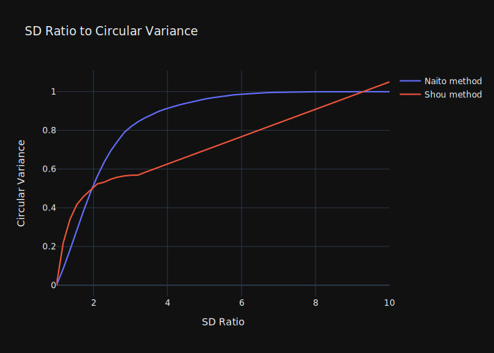
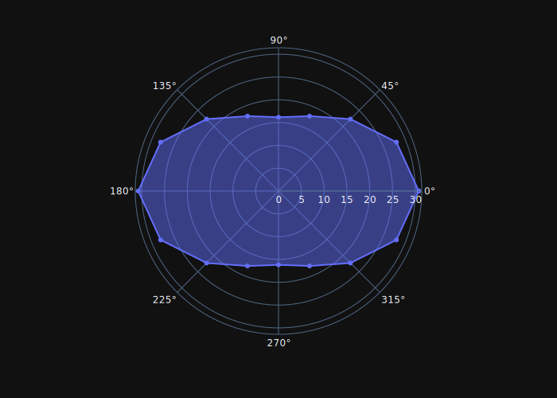

# Overview

## Creating Spatial filters with a specific circular variance

* Depends on the *definition* or *method* used, **which is often very dependant on what spatial frequency of stimulus is used to measure the orientation selectivity**.

_Loading spatial filter from file_

```python
import plotly.express as px
import plotly.graph_objects as go
import numpy as np

from lif.receptive_field.filters import (
	filter_functions as ff,
	filters,
	cv_von_mises as cvvm)
from lif.utils import data_objects as do
from lif.utils.units.units import SpatFrequency
from lif.plot import plot

import lif.utils.settings as settings
data_dir = settings.get_data_dir()
```

```python
sf_file_name = (
	'Kaplan_et_al_1987_contrast_affects_transmission_fig8A_open_circle-DOGSpatialFilter.pkl')
sf = do.DOGSpatialFilter.load(data_dir / sf_file_name)
sf.ori_bias_params.shou.circ_var2ratio(0.8)
# array(6.46365421)
```

### Comparing Methods

* How circular variance and SD ratio relate for different methods

```python
fig = plot.circ_var_sd_ratio_method_comparison(sf)

fig.show()
# fig.update_layout(template='plotly_dark').write_image('circ2ratio_multi_methods.svg')
```



* **Note the quirks of the `Shou` method**:
	- It asymptotes at a `circular variance` of `~0.55` then linearly increases beyond that.
	- THe linear ramp is an artefact of the `linear interpolation` used to generate `circular variance` and `SD ratio` values from each other.
	- **Chiefly,** `extrapolation` is allowed/enabled.
		+ It turns out that the `Shou` method uses the highest `spatial frequency` that a `receptive field` or `spatial filter` will respond to for the *non-preferred orientation*.
		+ This means that as the `spatial filter` gets more `biased` (ie, has a higher `SD ratio`), the highest `spatial frequency` that will get a response from the `non-preferred orientation` gets progressively *lower*.
		+ And, as the `spatial frequency` gets lower, the `circular variance` of the `spatial filter` will also get lower (they positively correlate).
		+ As a result, the `Shou` method measures high `circular variance` values for low `SD ratios` (as it selects relatively high `spatial frequencies`, basically the highest possible for stimuli of both the preferred and non-preferred orientations).  
		+ But, it then "bottoms out" at a maximal `circular variance` because it selects lower and lower `spatial frequencies` due to the decreasing responsiveness of the `spatial filter` to non-preferred orientations.
		+ From the point that the `Shou` method "bottoms out", the `interpolation` is simply extrapolating, and linearly so.
	- It's a bit dodgy, but generally it *should be fine*:
		+ The extrapolation occurs in a region of `circular variance` values that are unlikely or even never going to be used.
		+ The interpolation, at least for the extreme window of values it is occurring in, is decent enough ... it stays at relatively lower values (compared to `naito`), consistent with the general character of the method.
* By comparison, the `Naito` method selects `spatial frequencies` entirely according to responses to the `preferred orientation`.  As a result it isn't a self-limiting method like the `Shou` method.


### Creating Orientation Biased Spatial Filters

```python
ori_biased_sf = ff.mk_ori_biased_spatfilt_params_from_spat_filt(sf, circ_var=0.6)
```

```python
fig = plot.orientation_plot(ori_biased_sf, spat_freq=SpatFrequency(6))

fig.show()
# fig.update_layout(template='plotly_dark').write_image('new_ori_biased_filter_polar_plot.svg')
```



* `ff.mk_ori_biased_spatfilt_params_from_spat_filt` uses the `ori_bias_params` attribute of a `spatial filter` object (`do.DOGSpatialFilter`).
	- This object has methods for converting between `circular variance` and `SD ratio` values *for the parent `spatial filter`*.
	- So, the `circular variance` value is converted to an `SD ratio` (with `spat_filt.ori_bias_params.circ_var2ratio`).
	- This `ratio` is then passed to `cvvm.mk_ori_biased_sd_factors`, which generates from a ratio of the minor and major axis of a `spatial filter` the factors necessary to alter the `SD` values of the minor and major axes so that the have the prescribed `ratio` (by multiplying with the provided factors).
	- These factors are then used by the `spatial filter`'s core built-in utility for generating new versions of itself with an orientation bias: `spat_filt.parameters.mk_ori_biased_duplicate`, which takes the individual factors generated (above) and applies them to the underlying parameters of the spatial filter accordingly.
* Orientation biased `spatial filters` should retain the same `DC` response (response to a `spatial frequency` of `0`) as their original, radially symmetrical version.
	- This is because `cvvm.mk_ori_biased_sd_factors` creates factors such that the sum of the minor and major axis `SD` values will be the same retained.  IE, the average extent of the `gaussian` is retained, and therefore its integral is retained too.

## Circular variance definitions and integration with spatial filter creation

### General Overview

* A definition of `circular variance` is instantiated as a function (in the `cv_von_mises` module).
* This is then used in the creation of a `spatial filter` to generate lookup values that map between `circular variance` and `SD ratio` values.
	- Where `SD ratio` values are the direct way `spatial filters` are manipulated to have an `anisotropic` (ie lengthened) shape.
* Thus, once created, a `spatial filter`, through the pipeline outlined above, can be adjusted to have a specified `circular variance` _according to a specified **definition or method**_.

### Definition of a `circular variance` method

* Function that takes a `spatial filter` with a particular `SD ratio` and returns a `circular variance` `float` value.
* The function will recreate the way in which a particular method from the literature measured the `cirular variance` of actual cells.
* Principally, such methods will vary in how the determine what `spatial frequency` to use for the stimuli of various orientations (as presenting the matrix of `spatial frequency X orientation` stimuli is impractical).
* Additionally, such a function also takes the `orientations` and `spatial frequencies` to be used in measuring the provided `spatial filter`'s responses.
	- This is largely for the sake of flexibility.  
	- By convention, `8` orientations from `0°` to `180°`, and a high density of `frequencies` that go up to a value that elicits no response from the `spatial filter` ... all done by the method that calls the `circular variance` definition function for the purposes of creating a `spatial filter`.

### Writing a new method

* Write a function that matches the `Callable` `type/protocol` `CircVarSDRatioMethod`
	- That returns the `circular variance` as a single `float`.
* Add this function to the `_CircVarSDRatioMethods` `class` as an attribute.
	- This class is then instantiated as a variable directly on the module `cv_von_mises`.
* **Also** add a corresponding attribute to the `data_object` [CircularVarianceParams][utils.data_objects.CircularVarianceParams] (but with the `CircularVarianceSDRatioVals` type, as it will store a value lookup object).
	- _Yes_, this is clunky.  There's probably a better way to organise all of this.
	- There's a test that corresponding attributes have been added to both of these classes.
* The `spatial filter` making process will use all the methods listed in the the `circ_var_sd_ratio_methods` attribute on the `cv_von_mises` module (an instance of `_CircVarSDRatioMethods`).


::: receptive_field.filters.cv_von_mises

