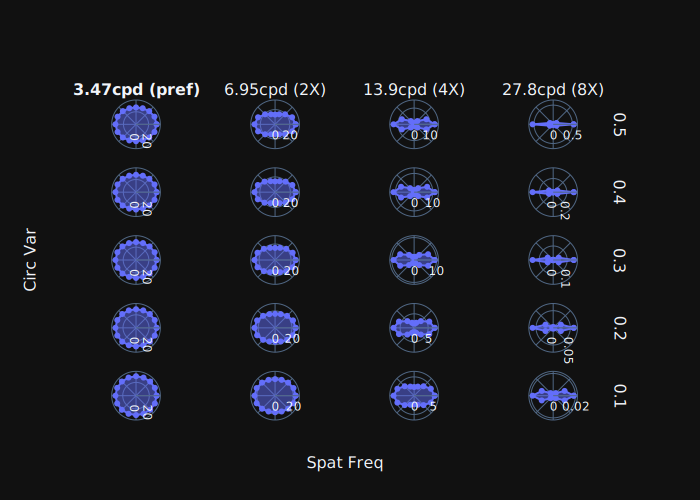
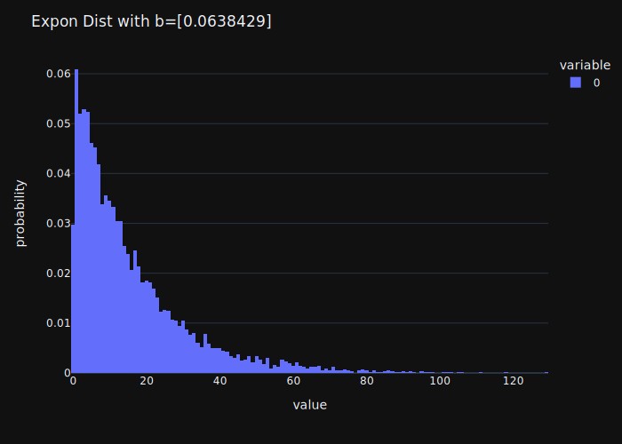

## Creating Filters from empirical data


Imports

```python
from typing import cast
```

```python
import pandas as pd
import numpy as np
import plotly.express as px
import plotly.graph_objects as go
import plotly.subplots as psp
```
```python
from scipy.interpolate.interpolate import interp1d
from lif.utils.units.units import ArcLength, SpatFrequency, TempFrequency, Time
from lif.utils import data_objects as do
from lif.receptive_field.filters import (
    filter_functions as ff, filters)
from lif.plot import plot
```

Get the `data directory` from `settings`

* Spatial filters **as well as the raw data they're derived from** are to be stored
in the `data directory`.

```python
import lif.utils.settings as settings
data_dir = settings.get_data_dir()
```


### Temp Filter


Get the raw data (captured with `tracey`)

```python
tf_raw_path = data_dir / 'Kaplan_et_al_1987_fig6A.csv'
tf_raw_data = pd.read_csv(tf_raw_path, header=None)  # type: ignore
tf_raw_data
```

<!-- #region -->
```python
          0         1         2         3         4         5         6         7
0 -1.955984 -0.921596  0.079780  1.081155  2.082531  3.083907  4.679505  6.088033
1  5.018553  4.907236  5.163265  5.497217  5.653061  5.653061  4.461966  1.333952
```
<!-- #endregion -->

* **Processing** raw `temp_filt` data
    * data originally represented in octaves ... *make linear*
    * rename columns for convenience

```python
clean_tf_raw_data: pd.DataFrame = 2**tf_raw_data.T  # type: ignore
clean_tf_raw_data.rename(columns={0: 'tf_hz', 1: 'resp_imp_s'}, inplace=True)
clean_tf_raw_data
```

<!-- #region -->
```python
       tf_hz  resp_imp_s
0   0.257745   32.414175
1   0.527925   30.007175
2   1.056857   35.834197
3   2.115730   45.167623
4   4.235496   50.320038
5   8.479074   50.320038
6  25.625439   22.038688
7  68.026892    2.520922
```
<!-- #endregion -->

save clean data (if necessary)

```python
clean_tf_raw_data.to_csv(data_dir/'Kaplan_et_al_1987_fig6A_clean.csv', index=False)
```

#### Loading *cleaned* data from file in data dir

```python
clean_tf_raw_data = pd.read_csv(data_dir/'Kaplan_et_al_1987_fig6A_clean.csv')  # type: ignore
```

#### Preparing data for tq tf fit


Extract values from dataframe and
**ENSURE frequency are the appropriate unit and scale**, which depends on the original data

```python
amps = clean_tf_raw_data.resp_imp_s.values
#  User must know that original data is in hertz ------V
fs = do.TempFrequency(clean_tf_raw_data.tf_hz.values, 'hz')
```

Define a `TempFiltParams` object with all requisite data and metadata

```python
# basic data
data = do.TempFiltData(fs, amps)
# metadata about experimental conditions under which data was created
resp_params = do.TFRespMetaData(
    dc=12, contrast=0.4, mean_lum=100,
    sf=do.SpatFrequency(0.8, 'cpd')
    )
# bibliographic metadata
meta_data = do.CitationMetaData(
    'Kaplan et al', 1987,
    'contrast affects transmission', 'fig 6a open circles')
```
```python
tf_params = do.TempFiltParams(
    data=data,
    resp_params=resp_params,
    meta_data=meta_data
    )
```

#### Fitting a temp filter to the raw data


* The `filters` module contains "simple" to use functions for fitting data to the specified filter type.
* These functions will accept the full `empirical-data-object` as their input, and
return a `filter` object by performing the necessary optimisation.
* This `filter` object will contain:
    * Raw data (as provided by to the fitting function)
    * Optimisation object as returned by the optimisation function
      (with information about the goodness of fit)
    * Parameters of the actual filter that will be used by the simulation code

```python
tqtf = filters.make_tq_temp_filt(parameters=tf_params)
```

EG, this object now contains the filter parameters and optimisation results

```python
tqtf.parameters.asdict_()
```

<!-- #region -->
```python
{'amplitude': 301.920227430036,
 'arguments': {'tau': {'value': 14.902653977227773,
   'unit': 'ms',
   '_base_unit': 's',
   '_s': 1,
   '_ms': 0.001,
   '_us': 1e-06},
  'w': 11.420030537940058,
  'phi': 1.1201854258947725}}
```
<!-- #endregion -->

```python
tqtf.optimisation_result.success
```

<!-- #region -->
```python
True
```
<!-- #endregion -->

#### Graphing results


Use the `plot` module (which should be convenient)

```python
fig = plot.tq_temp_filt_fit(tqtf)
fig.show()
```
```python
fig.write_image('tq_temp_filt_fit.svg')
```

write to html file like so ...

```python
# fig.write_html('tq_temp_filt_fit.html', include_plotlyjs='cdn')
# writing static images requires kaleido
fig.update_layout(template='plotly_dark').write_image('tq_temp_filt_fit.svg')
```


#### Saving Filter


save and load methods are built into the temporal filter object itself.

```python
tqtf.save()
```

Overwrite the previous file **if necessary**

```python
tqtf.save(overwrite=True)
```

#### Loading the filter


Filter object has utility functions for managing saved filters

```python
for filter in do.TQTempFilter.get_saved_filters():
    print(f'{filter.parent} ...')
    print(filter.name)
    print('')
```

```
/Users/errollloyd/.lif_hws_data ...
Kaplan_et_al_1987_contrast_affects_transmission_fig_6a_open_circles-TQTempFilter.pkl
```

```python
loaded_tqtf = do.TQTempFilter.load(
    do.TQTempFilter.get_saved_filters()[0])
```


### Spat Filt


#### Pre-Cleaned CSV Data


This has already been cleaned

```python
sf_data_raw = data_dir / 'Kaplan_et_al_1987_fig8A.csv'
sf_data_raw_df = pd.read_csv(sf_data_raw)
```

```
        freq        amp
0   0.102946  15.648086
1   0.256909  16.727744
2   0.515686  15.764523
3   1.035121  18.014953
4   2.062743  27.488355
5   4.140486  28.952478
6   8.311079  16.119054
7  16.205212   1.355197
8  33.003893   1.537217
```


#### Preparing data for DOG spat filt Fitting


Extract values from dataframe and
**ENSURE frequency are the appropriate unit and scale**, which depends on the original data

```python
data = do.SpatFiltData(
    amplitudes=sf_data_raw_df['amp'].values,  # type: ignore
    #  User must know that the original data is in CPD -------V
    frequencies=SpatFrequency(sf_data_raw_df['freq'].values, 'cpd')  # type: ignore
    )
```
```python
resp_params = do.SFRespMetaData(
    dc=15, tf=TempFrequency(4, 'hz'),
    mean_lum=100, contrast=0.5
    )
meta_data = do.CitationMetaData(
    author='Kaplan_et_al',
    year=1987,
    title='contrast affects transmission',
    reference='fig8A_open_circle',
    doi=None)
```
```python
sf_params = do.SpatFiltParams(
    data = data, resp_params = resp_params, meta_data = meta_data
    )
```

#### Fitting a DOG Spatial Filter

```python
sf = filters.make_dog_spat_filt(sf_params)
```
```python
sf.parameters.asdict_()
```
```
{'cent': {'amplitude': 36.426593766279,
  'arguments': {'h_sd': {'value': 1.4763319227563279,
    'unit': 'mnt',
     ...},
   'v_sd': {'value': 1.4763319227563279,
    'unit': 'mnt',
     ...}}},
 'surr': {'amplitude': 21.123002549917594,
  'arguments': {'h_sd': {'value': 6.455530620581974,
    'unit': 'mnt',
     ...},
   'v_sd': {'value': 6.455530620581974,
    'unit': 'mnt',
     ...}}}}
```


#### Saving and Loading


Same saving and loading and "*getter*" as with temp filters above.

```python
# sf.save(overwrite=True)
# do.DOGSpatialFilter.load()
# do.DOGSpatialFilter.save()
# do.DOGSpatialFilter.get_saved_filters()
loaded_sf = do.DOGSpatialFilter.load(do.DOGSpatialFilter.get_saved_filters()[0])
```

## Graphing Filters


### Filters


Temporal filter

```python
from importlib import reload
```

```python
tqtf = do.TQTempFilter.load(do.TQTempFilter.get_saved_filters()[0])
fig = plot.tq_temp_filt(tqtf)
# fig.update_layout(template='plotly_dark').write_image('tq_temp_filt.svg')
```


Spatial Filter

```python
sf = do.DOGSpatialFilter.load(do.DOGSpatialFilter.get_saved_filters()[0])
fig = plot.spat_filt(sf, spat_res=ArcLength(20, 'sec'))
# fig.update_layout(template='plotly_dark').write_image('spat_filt.svg')
```


### The fits of filters to their raw data


temporal filter ...

```python
tqtf = do.TQTempFilter.load(do.TQTempFilter.get_saved_filters()[0])
fig = plot.tq_temp_filt_fit(tqtf)
# fig.update_layout(template='plotly_dark').write_image('tq_temp_filt_fit.svg')
```


```python
tqtf = do.TQTempFilter.load(do.TQTempFilter.get_saved_filters()[0])
fig = plot.tq_temp_filt_profile(tqtf)
# fig.update_layout(template='plotly_dark').write_image('tq_temp_filt_profile.svg')
```


spatial filter ...

```python
sf = do.DOGSpatialFilter.load(do.DOGSpatialFilter.get_saved_filters()[0])
fig = plot.spat_filt_fit(sf)
# fig.update_layout(template='plotly_dark').write_image('dog_sf_filt_fit.svg')
```


### Interpolation of combined Spatial and Temporal Filter

```python
fig = plot.joint_sf_tf_amp(tqtf, sf, n_increments=50)
# fig.update_layout(template='plotly_dark').write_image('joint_sf_tf_interp.svg')
```


### The Orientation Selectivity of a Spatial Filter


Basic polar plot of orientation preference

```python
ori_sf = ff.mk_ori_biased_spatfilt_params_from_spat_filt(sf, circ_var=0.8)
freq = SpatFrequency(4)
fig = plot.orientation_plot(ori_sf, freq)
# fig.update_layout(template='plotly_dark').write_image('ori_polar.svg')
```


Spatial frequency responses to vertical and horizantally oriented gratings

```python
ori_sf = ff.mk_ori_biased_spatfilt_params_from_spat_filt(sf, circ_var=0.8)
fig = plot.dog_sf_ft_hv(ori_sf, use_log_freqs=True)
# fig.update_layout(template='plotly_dark').write_image('ori_hv_spat_freq.svg')
```


Heatmap of response to orientation x SF
helpful for quickly viewing the overall orientation selectivity of the RF

```python
ori_sf = ff.mk_ori_biased_spatfilt_params_from_spat_filt(sf, circ_var=0.8)
fig = plot.ori_spat_freq_heatmap(ori_sf, n_orientations=16 )
# fig.update_layout(template='plotly_dark').write_image('ori_spat_freq_heatmap.svg')
```


Orientation preference plots (polar) for a matrix of circular variance and SF values

```python
fig = plot.orientation_circ_var_subplots(sf)
fig.update_layout(template='plotly_dark').write_image('ori_spat_freq_subplots.svg')
```




## Record of Filter Creation


All filters standard in this package ought to have been created here.


### NB Boilerplate

```python
import os

GLOBAL_ENV_VARS = {
    'WRITE_FIG': True,  # whether to write new figures
    'SHOW_FIG': False,  # whether to show new figures
    'RUN_LONG': False,  # whether to run long tasks
}

print('***\nSetting Env Variables\n***\n')
for GEV, DEFAULT_VALUE in GLOBAL_ENV_VARS.items():
    runtime_value = os.environ.get(GEV)  # defaults to None
    # parse strings into booleans, but only if actual value provided
    if runtime_value:
        new_value = (
                True
                    if runtime_value == "True"
                    else False
                )
    # if none provided, just take default value
    else:
        new_value = DEFAULT_VALUE
    print(f'Setting {GEV:<10} ... from {str(DEFAULT_VALUE):<5} to {str(new_value):<5} (runtime value: {runtime_value})')
    GLOBAL_ENV_VARS[GEV] = new_value

def show_fig(fig):
    if GLOBAL_ENV_VARS['SHOW_FIG']:
        fig.show()

def write_fig(fig, file_name: str, **kwargs):
    if GLOBAL_ENV_VARS['WRITE_FIG']:
        fig.write_image(file_name, **kwargs)
```

```python
# For live work
# GLOBAL_ENV_VARS['SHOW_FIG'] = True
```

### DC Data


Not all filters came with well reported DC data
Sooo ... take Data from Kaplan_et_al_1987_fig1

```python
import scipy.stats as stats
import scipy.optimize as opt
```

Fit data to exponential function then make an exponential distribution from that parameter

```python
def basic_exp(x, b):
    return np.exp(-b * x)

# data from Kaplan_et_al_1987 fig 1
xdata = np.array([10, 20, 30, 40])
ydata = np.array([29, 17, 6, 1])
ydata_norm = ydata / ydata.sum()

opt_res = opt.curve_fit(
    basic_exp, xdata, ydata_norm, p0=[0.01]
    )
```
```python
b = opt_res[0]
x_vals = np.linspace(0, max(xdata), 100)
y_vals = basic_exp(x_vals, b)

fig = (
    px
    .line(x=x_vals, y=y_vals)
    .add_scatter(x=xdata, y=ydata_norm, mode='markers')
    )
show_fig(fig)
```

```python
b = opt_res[0]

DC_dist = stats.expon(scale=1/b)
vals = DC_dist.rvs(size=10_000)
fig = px.histogram(vals, histnorm='probability').update_layout(title=f'Expon Dist with b={b}')
```
```python
show_fig(fig)
write_fig(
    fig.update_layout(template='plotly_dark'),
    'DC_firing_rates_from_kaplan_87_fit_histogram.svg')
```




This distribution is now called on directly in a `resolve()` method on `SDRespMetaData` objects.
The idea is that when a simulation is actually run, or ever a `DC` value needed, this `resolve`
method can be called to ensure that there is one, where a new object with the same values
is returned, but a generated DC value if necessary.


### Spatial Filters

```python
filter_data_dir = data_dir / 'filter_data_images'
```

#### Dawis_et_al_1984_fig3a_bottom

```python
sf_raw_path = filter_data_dir / 'Dawis_et_al_1984_fig3a_bottom.csv'
```

##### Data cleaning and transformation


Get the raw data (captured with `tracey`)

```python
sf_raw_data = pd.read_csv(sf_raw_path, header=None)  # type: ignore
sf_raw_data  # type: ignore
```

* **Processing** raw `spat_filt` data
    * Log base 10 used on both axes
    * rename columns for convenience

```python
clean_sf_raw_data = 10**sf_raw_data.T  # type: ignore
clean_sf_raw_data.rename(columns={0: 'sf_cpd', 1: 'resp_imp_s'}, inplace=True)
clean_sf_raw_data  # type: ignore
```

```python
fig = px.line(clean_sf_raw_data, x='sf_cpd', y='resp_imp_s'
    ).update_layout(
        xaxis_type='log', yaxis_type='log'
    )
show_fig(fig)
```

save clean data (if necessary)

```python
clean_sf_raw_data.to_csv(filter_data_dir/f'{sf_raw_path.stem}_clean.csv', index=False)
```

##### Create Filter from Cleaned CSV Data


```python
sf_raw_path = filter_data_dir / 'Dawis_et_al_1984_fig3a_bottom.csv'
sf_data_raw = filter_data_dir / f'{sf_raw_path.stem}_clean.csv'
sf_data_raw_df = pd.read_csv(sf_data_raw)
sf_data_raw_df = cast(pd.DataFrame, sf_data_raw_df)
```

Extract values from dataframe and
**ENSURE frequency are the appropriate unit and scale**, which depends on the original data

```python
sf_vals = sf_data_raw_df['sf_cpd'].values  # type: ignore
sf_vals=cast(np.ndarray, sf_vals)
amp_vals = sf_data_raw_df['resp_imp_s'].values  # type: ignore
amp_vals=cast(np.ndarray, amp_vals)

data = do.SpatFiltData(
    amplitudes=amp_vals,
    #  User must know that the original data is in CPD
    #                                    V----------^
    frequencies=SpatFrequency(sf_vals, 'cpd')
    )
```

Compile metadata along with response data into appropriate objects

```python
resp_params = do.SFRespMetaData(
    dc=None,
    tf=TempFrequency(1, 'hz'),
    mean_lum=102,
    contrast=0.14
    )
meta_data = do.CitationMetaData(
    author='Dawis_et_al',
    year=1984,
    title='receptive field organization of X-cells',
    reference='fig3A_bottom',
    doi='https://doi.org/10.1016/0042-6989(84)90109-3')
```
```python
sf_params = do.SpatFiltParams(
    data = data, resp_params = resp_params, meta_data = meta_data
    )
```


```python
sf = filters.make_dog_spat_filt(sf_params)
```

```python
# plot.spat_filt(sf, sd=True).show()
# plot.spat_filt_fit(sf).show()
# plot.orientation_circ_var_subplots(sf).show()
```

```python
sf.save()
```


#### Soodak_et_al_1987_fig3a

```python
sf_raw_path = filter_data_dir / 'Soodak_et_al_1987_fig3a.csv'
```

##### Data cleaning and transformation


Get the raw data (captured with `tracey`)

```python
sf_raw_data = pd.read_csv(sf_raw_path, header=None)  # type: ignore
sf_raw_data = cast(pd.DataFrame, sf_raw_data)
sf_raw_data  # type: ignore
```

* **Processing** raw `spat_filt` data
    * Two curves (at preferred and non-preferred orientation) ... take the average of the two.
    * rename columns for convenience

```python
first_curve = sf_raw_data.loc[:1].reset_index(drop=True)
second_curve = sf_raw_data.loc[2:].reset_index(drop=True)
avg_curve = (first_curve+second_curve) / 2
clean_sf_raw_data = (
    avg_curve
    .dropna(axis='columns')
    .T
    .rename(columns={0: 'sf_cpd', 1: 'resp_imp_s'})
    )
```

```python
fig = px.line(clean_sf_raw_data, x='sf_cpd', y='resp_imp_s')
show_fig(fig)
```

save clean data (if necessary)

```python
clean_sf_raw_data.to_csv(filter_data_dir/f'{sf_raw_path.stem}_clean.csv', index=False)
```

##### Create Filter from Cleaned CSV Data


```python
sf_raw_path = filter_data_dir / 'Soodak_et_al_1987_fig3a.csv'
sf_data_raw = filter_data_dir / f'{sf_raw_path.stem}_clean.csv'
sf_data_raw_df = pd.read_csv(sf_data_raw)
sf_data_raw_df = cast(pd.DataFrame, sf_data_raw_df)
```

Extract values from dataframe and
**ENSURE frequency are the appropriate unit and scale**, which depends on the original data

```python
sf_vals = sf_data_raw_df['sf_cpd'].values  # type: ignore
sf_vals=cast(np.ndarray, sf_vals)
amp_vals = sf_data_raw_df['resp_imp_s'].values  # type: ignore
amp_vals=cast(np.ndarray, amp_vals)

data = do.SpatFiltData(
    amplitudes=amp_vals,
    #  User must know that the original data is in CPD
    #                                    V----------^
    frequencies=SpatFrequency(sf_vals, 'cpd')
    )
```

Compile metadata along with response data into appropriate objects

```python
# Temp Freq: 4Hz, Mean Lum: 100 `cd/m2`, contrast: `0.2`.
resp_params = do.SFRespMetaData(
    dc=None,
    tf=TempFrequency(4, 'hz'),
    mean_lum=100,
    contrast=0.2
    )
meta_data = do.CitationMetaData(
    author='Soodak_et_al',
    year=1987,
    title='linear mechanism of orientation tuning',
    reference='fig3A',
    doi=None)
```
```python
sf_params = do.SpatFiltParams(
    data = data, resp_params = resp_params, meta_data = meta_data
    )
```


```python
sf = filters.make_dog_spat_filt(sf_params)
```

```python
# plot.spat_filt(sf, sd=True).show()
# plot.spat_filt_fit(sf).show()
# plot.orientation_circ_var_subplots(sf).show()
```

```python
sf.save()
```
```python

```


#### soodak_et_al_1991_fig1_left

```python
sf_raw_path = filter_data_dir / 'soodak_et_al_1991_fig1_left.csv'
```

##### Data cleaning and transformation


Get the raw data (captured with `tracey`)

```python
sf_raw_data = pd.read_csv(sf_raw_path, header=None)  # type: ignore
sf_raw_data = cast(pd.DataFrame, sf_raw_data)
sf_raw_data  # type: ignore
```

* **Processing** raw `spat_filt` data
    * *Log2 on x axis, log10 on y*
    * *Need to average the two curves*
    * rename columns for convenience

```python
first_curve = sf_raw_data.loc[:1].reset_index(drop=True)
second_curve = sf_raw_data.loc[2:].reset_index(drop=True)

first_curve.loc[0] = 2**(first_curve.loc[0])
first_curve.loc[1] = 10**(first_curve.loc[1])
second_curve.loc[0] = 2**(second_curve.loc[0])
second_curve.loc[1] = 10**(second_curve.loc[1])

avg_curve = (first_curve+second_curve) / 2
clean_sf_raw_data = (
    avg_curve
    .dropna(axis='columns')
    .T
    .rename(columns={0: 'sf_cpd', 1: 'resp_imp_s'})
    )
```

```python
fig = px.line(clean_sf_raw_data, x='sf_cpd', y='resp_imp_s')
show_fig(fig)
```

save clean data (if necessary)

```python
clean_sf_raw_data.to_csv(filter_data_dir/f'{sf_raw_path.stem}_clean.csv', index=False)
```

##### Create Filter from Cleaned CSV Data


```python
sf_raw_path = filter_data_dir / 'soodak_et_al_1991_fig1_left.csv'
sf_data_raw = filter_data_dir / f'{sf_raw_path.stem}_clean.csv'
sf_data_raw_df = pd.read_csv(sf_data_raw)
sf_data_raw_df = cast(pd.DataFrame, sf_data_raw_df)
```

Extract values from dataframe and
**ENSURE frequency are the appropriate unit and scale**, which depends on the original data

```python
sf_vals = sf_data_raw_df['sf_cpd'].values  # type: ignore
sf_vals=cast(np.ndarray, sf_vals)
amp_vals = sf_data_raw_df['resp_imp_s'].values  # type: ignore
amp_vals=cast(np.ndarray, amp_vals)

data = do.SpatFiltData(
    amplitudes=amp_vals,
    #  User must know that the original data is in CPD
    #                                    V----------^
    frequencies=SpatFrequency(sf_vals, 'cpd')
    )
```

Compile metadata along with response data into appropriate objects

```python
# Temp Freq: 4Hz, Mean Lum: 100 `cd/m2`, contrast: `0.2`.
resp_params = do.SFRespMetaData(
    dc=None,
    tf=TempFrequency(4, 'hz'),
    mean_lum=100,
    contrast=0.2
    )
meta_data = do.CitationMetaData(
    author='Soodak_et_al',
    year=1991,
    title='fine structure of receptive-field centers',
    reference='fig1_left',
    doi='https://doi.org/10.1017/S0952523800002613')
```
```python
sf_params = do.SpatFiltParams(
    data = data, resp_params = resp_params, meta_data = meta_data
    )
```

```python
sf = filters.make_dog_spat_filt(sf_params)
```

```python
# plot.spat_filt(sf, sd=True).show()
# plot.spat_filt_fit(sf).show()
# plot.orientation_circ_var_subplots(sf).show()
```

```python
sf.save()
```
```python

```


#### soodak_et_al_1991_fig3A

```python
sf_raw_path = filter_data_dir / 'soodak_et_al_1991_fig3a.csv'
```

##### Data cleaning and transformation


Get the raw data (captured with `tracey`)

```python
sf_raw_data = pd.read_csv(sf_raw_path, header=None)  # type: ignore
sf_raw_data = cast(pd.DataFrame, sf_raw_data)
sf_raw_data  # type: ignore
```

* **Processing** raw `spat_filt` data
    * *Need to average the two curves*
    * rename columns for convenience

```python
first_curve = sf_raw_data.loc[:1].reset_index(drop=True)
second_curve = sf_raw_data.loc[2:].reset_index(drop=True)

avg_curve = (first_curve+second_curve) / 2
clean_sf_raw_data = (
    avg_curve
    .dropna(axis='columns')
    .T
    .rename(columns={0: 'sf_cpd', 1: 'resp_imp_s'})
    )
```

```python
fig = px.line(clean_sf_raw_data, x='sf_cpd', y='resp_imp_s')
show_fig(fig)
```

save clean data (if necessary)

```python
clean_sf_raw_data.to_csv(filter_data_dir/f'{sf_raw_path.stem}_clean.csv', index=False)
```

##### Create Filter from Cleaned CSV Data


```python
sf_raw_path = filter_data_dir / 'soodak_et_al_1991_fig3a.csv'
sf_data_raw = filter_data_dir / f'{sf_raw_path.stem}_clean.csv'
sf_data_raw_df = pd.read_csv(sf_data_raw)
sf_data_raw_df = cast(pd.DataFrame, sf_data_raw_df)
```
```python
fig = px.line(sf_data_raw_df, x='sf_cpd', y='resp_imp_s')
show_fig(fig)
```

Extract values from dataframe and
**ENSURE frequency are the appropriate unit and scale**, which depends on the original data

```python
sf_vals = sf_data_raw_df['sf_cpd'].values  # type: ignore
sf_vals=cast(np.ndarray, sf_vals)
amp_vals = sf_data_raw_df['resp_imp_s'].values  # type: ignore
amp_vals=cast(np.ndarray, amp_vals)

data = do.SpatFiltData(
    amplitudes=amp_vals,
    #  User must know that the original data is in CPD
    #                                    V----------^
    frequencies=SpatFrequency(sf_vals, 'cpd')
    )
```

Compile metadata along with response data into appropriate objects

```python
# Temp Freq: 4Hz, Mean Lum: 100 `cd/m2`, contrast: `0.2`.
resp_params = do.SFRespMetaData(
    dc=None,
    tf=TempFrequency(4, 'hz'),
    mean_lum=100,
    contrast=0.2
    )
meta_data = do.CitationMetaData(
    author='Soodak_et_al',
    year=1991,
    title='fine structure of receptive-field centers',
    reference='fig3A',
    doi='https://doi.org/10.1017/S0952523800002613')
```
```python
sf_params = do.SpatFiltParams(
    data = data, resp_params = resp_params, meta_data = meta_data
    )
```

```python
sf = filters.make_dog_spat_filt(sf_params)
```

```python
# plot.spat_filt(sf, sd=True).show()
# plot.spat_filt_fit(sf).show()
# plot.orientation_circ_var_subplots(sf).show()
```

```python
sf.save()
```
```python

```


#### Barardi_Morrone_1984_fig6_open_circle

```python
sf_raw_path = filter_data_dir / 'Barardi_Morrone_1984_fig6_open_circle.csv'
```

##### Data cleaning and transformation


Get the raw data (captured with `tracey`)

```python
sf_raw_data = pd.read_csv(sf_raw_path, header=None)  # type: ignore
sf_raw_data = cast(pd.DataFrame, sf_raw_data)
sf_raw_data  # type: ignore
```

* **Processing** raw `spat_filt` data
    * X axis is log base 10
    * rename columns for convenience

```python
sf_raw_data.loc[0] = 10**(sf_raw_data.loc[0])
clean_sf_raw_data = (
    sf_raw_data
    .T
    .rename(columns={0: 'sf_cpd', 1: 'resp_imp_s'})
    )
```

```python
fig = px.line(clean_sf_raw_data, x='sf_cpd', y='resp_imp_s')
show_fig(fig)
```

save clean data (if necessary)

```python
clean_sf_raw_data.to_csv(filter_data_dir/f'{sf_raw_path.stem}_clean.csv', index=False)
```

##### Create Filter from Cleaned CSV Data


```python
sf_raw_path = filter_data_dir / 'Barardi_Morrone_1984_fig6_open_circle.csv'
sf_data_raw = filter_data_dir / f'{sf_raw_path.stem}_clean.csv'
sf_data_raw_df = pd.read_csv(sf_data_raw)
sf_data_raw_df = cast(pd.DataFrame, sf_data_raw_df)
```
```python
fig = px.line(sf_data_raw_df, x='sf_cpd', y='resp_imp_s')
show_fig(fig)
```

Extract values from dataframe and
**ENSURE frequency are the appropriate unit and scale**, which depends on the original data

```python
sf_vals = sf_data_raw_df['sf_cpd'].values  # type: ignore
sf_vals=cast(np.ndarray, sf_vals)
amp_vals = sf_data_raw_df['resp_imp_s'].values  # type: ignore
amp_vals=cast(np.ndarray, amp_vals)

data = do.SpatFiltData(
    amplitudes=amp_vals,
    #  User must know that the original data is in CPD
    #                                    V----------^
    frequencies=SpatFrequency(sf_vals, 'cpd')
    )
```

Compile metadata along with response data into appropriate objects

```python
# Temp Freq: 4Hz, Mean Lum: 50 `cd/m2` (possibly varied), contrast: `0.15`.
# DC? ... `17Hz generally`
resp_params = do.SFRespMetaData(
    dc=17,
    tf=TempFrequency(4, 'hz'),
    mean_lum=50,
    contrast=0.15
    )
meta_data = do.CitationMetaData(
    author='Berardi_Morrone',
    year=1984,
    title='role of gamma-aminobutyric acid mediated inhibition',
    reference='fig6_open_circle',
    doi='https://doi.org/10.1113/jphysiol.1984.sp015514')
```
```python
sf_params = do.SpatFiltParams(
    data = data, resp_params = resp_params, meta_data = meta_data
    )
```

```python
sf = filters.make_dog_spat_filt(sf_params)
```

```python
# plot.spat_filt(sf, sd=True).show()
# plot.spat_filt_fit(sf).show()
# plot.orientation_circ_var_subplots(sf).show()
```

```python
sf.save()
```
```python

```


#### Barardi_Morrone_1984_fig5A

```python
sf_raw_path = filter_data_dir / 'Barardi_Morrone_1984_fig5A.csv'
```

##### Data cleaning and transformation


Get the raw data (captured with `tracey`)

```python
sf_raw_data = pd.read_csv(sf_raw_path, header=None)  # type: ignore
sf_raw_data = cast(pd.DataFrame, sf_raw_data)
sf_raw_data  # type: ignore
```

* **Processing** raw `spat_filt` data
    * X axis is log base 10
    * rename columns for convenience

```python
sf_raw_data.loc[0] = 10**(sf_raw_data.loc[0])
clean_sf_raw_data = (
    sf_raw_data
    .T
    .rename(columns={0: 'sf_cpd', 1: 'resp_imp_s'})
    )
```

```python
fig = px.line(clean_sf_raw_data, x='sf_cpd', y='resp_imp_s')
show_fig(fig)
```

save clean data (if necessary)

```python
clean_sf_raw_data.to_csv(filter_data_dir/f'{sf_raw_path.stem}_clean.csv', index=False)
```

##### Create Filter from Cleaned CSV Data


```python
sf_raw_path = filter_data_dir / 'Barardi_Morrone_1984_fig5A.csv'
sf_data_raw = filter_data_dir / f'{sf_raw_path.stem}_clean.csv'
sf_data_raw_df = pd.read_csv(sf_data_raw)
sf_data_raw_df = cast(pd.DataFrame, sf_data_raw_df)
```
```python
fig = px.line(sf_data_raw_df, x='sf_cpd', y='resp_imp_s')
show_fig(fig)
```

Extract values from dataframe and
**ENSURE frequency are the appropriate unit and scale**, which depends on the original data

```python
sf_vals = sf_data_raw_df['sf_cpd'].values  # type: ignore
sf_vals=cast(np.ndarray, sf_vals)
amp_vals = sf_data_raw_df['resp_imp_s'].values  # type: ignore
amp_vals=cast(np.ndarray, amp_vals)

data = do.SpatFiltData(
    amplitudes=amp_vals,
    #  User must know that the original data is in CPD
    #                                    V----------^
    frequencies=SpatFrequency(sf_vals, 'cpd')
    )
```

Compile metadata along with response data into appropriate objects

```python
# Temp Freq: "*Optimum*", Mean Lum: 50 `cd/m2` (possibly varied), contrast: `0.10`.
# In all other figures, temporal frequencies for X cells are `3-5Hz` (sometimes `2.5Hz`).  Can probably just take a random value from this range ... `4Hz`
# DC? ... `17Hz generally`
resp_params = do.SFRespMetaData(
    dc=17,
    tf=TempFrequency(4, 'hz'),
    mean_lum=50,
    contrast=0.1
    )
meta_data = do.CitationMetaData(
    author='Berardi_Morrone',
    year=1984,
    title='role of gamma-aminobutyric acid mediated inhibition',
    reference='fig5A',
    doi='https://doi.org/10.1113/jphysiol.1984.sp015514')
```
```python
sf_params = do.SpatFiltParams(
    data = data, resp_params = resp_params, meta_data = meta_data
    )
```

```python
sf = filters.make_dog_spat_filt(sf_params)
```

```python
# plot.spat_filt(sf, sd=True).show()
# plot.spat_filt_fit(sf).show()
# plot.orientation_circ_var_subplots(sf).show()
```

```python
sf.save()
```
```python

```


#### Barardi_Morrone_1984_fig5B

```python
sf_raw_path = filter_data_dir / 'Barardi_Morrone_1984_fig5B.csv'
```

##### Data cleaning and transformation


Get the raw data (captured with `tracey`)

```python
sf_raw_data = pd.read_csv(sf_raw_path, header=None)  # type: ignore
sf_raw_data = cast(pd.DataFrame, sf_raw_data)
sf_raw_data  # type: ignore
```

* **Processing** raw `spat_filt` data
    * X axis is log base 10
    * rename columns for convenience

```python
sf_raw_data.loc[0] = 10**(sf_raw_data.loc[0])
clean_sf_raw_data = (
    sf_raw_data
    .T
    .rename(columns={0: 'sf_cpd', 1: 'resp_imp_s'})
    )
```

```python
fig = px.line(clean_sf_raw_data, x='sf_cpd', y='resp_imp_s')
show_fig(fig)
```

save clean data (if necessary)

```python
clean_sf_raw_data.to_csv(filter_data_dir/f'{sf_raw_path.stem}_clean.csv', index=False)
```

##### Create Filter from Cleaned CSV Data


```python
sf_raw_path = filter_data_dir / 'Barardi_Morrone_1984_fig5B.csv'
sf_data_raw = filter_data_dir / f'{sf_raw_path.stem}_clean.csv'
sf_data_raw_df = pd.read_csv(sf_data_raw)
sf_data_raw_df = cast(pd.DataFrame, sf_data_raw_df)
```
```python
fig = px.line(sf_data_raw_df, x='sf_cpd', y='resp_imp_s')
show_fig(fig)
```

Extract values from dataframe and
**ENSURE frequency are the appropriate unit and scale**, which depends on the original data

```python
sf_vals = sf_data_raw_df['sf_cpd'].values  # type: ignore
sf_vals=cast(np.ndarray, sf_vals)
amp_vals = sf_data_raw_df['resp_imp_s'].values  # type: ignore
amp_vals=cast(np.ndarray, amp_vals)

data = do.SpatFiltData(
    amplitudes=amp_vals,
    #  User must know that the original data is in CPD
    #                                    V----------^
    frequencies=SpatFrequency(sf_vals, 'cpd')
    )
```

Compile metadata along with response data into appropriate objects

```python
# Temp Freq: "*Optimum*", Mean Lum: 50 `cd/m2` (possibly varied), contrast: `0.10`.
# In all other figures, temporal frequencies for X cells are `3-5Hz` (sometimes `2.5Hz`).  Can probably just take a random value from this range ... `4Hz`
# DC? ... `17Hz generally`
resp_params = do.SFRespMetaData(
    dc=17,
    tf=TempFrequency(4, 'hz'),
    mean_lum=50,
    contrast=0.1
    )
meta_data = do.CitationMetaData(
    author='Berardi_Morrone',
    year=1984,
    title='role of gamma-aminobutyric acid mediated inhibition',
    reference='fig5B',
    doi='https://doi.org/10.1113/jphysiol.1984.sp015514')
```
```python
sf_params = do.SpatFiltParams(
    data = data, resp_params = resp_params, meta_data = meta_data
    )
```

```python
sf = filters.make_dog_spat_filt(sf_params)
```

```python
# plot.spat_filt(sf, sd=True).show()
# plot.spat_filt_fit(sf).show()
# plot.orientation_circ_var_subplots(sf).show()
```

```python
sf.save()
```
```python

```


#### Maffei_Fiorentini_1973_Fig2_left

```python
sf_raw_path = filter_data_dir / 'Maffei_Fiorentini_1973_Fig2.csv'
```

##### Data cleaning and transformation


Get the raw data (captured with `tracey`)

```python
sf_raw_data = pd.read_csv(sf_raw_path, header=None)  # type: ignore
sf_raw_data = cast(pd.DataFrame, sf_raw_data)
sf_raw_data  # type: ignore
```

* **Processing** raw `spat_filt` data
    * Take left curve (first two rows)
    * X and Y axis is log base 10
    * Y axis is normalised response (max is 1) ... need to scale to appropriate response amp
    * rename columns for convenience

```python
# to get amplitude from figure 7 given contrast
# np.random.uniform(low=65, high=75, size=1)[0]
max_amplitude = 73.179
```
```python
sf_raw_data = sf_raw_data.loc[:1].reset_index(drop=True)
sf_raw_data = 10**(sf_raw_data)
sf_raw_data.loc[1] *= max_amplitude
clean_sf_raw_data = (
    sf_raw_data
    .T
    .rename(columns={0: 'sf_cpd', 1: 'resp_imp_s'})
    )
```

```python
fig = px.line(clean_sf_raw_data, x='sf_cpd', y='resp_imp_s')
show_fig(fig)
```

save clean data (if necessary)

```python
clean_sf_raw_data.to_csv(filter_data_dir/f'{sf_raw_path.stem}_left_clean.csv', index=False)
```

##### Create Filter from Cleaned CSV Data


```python
sf_raw_path = filter_data_dir / 'Maffei_Fiorentini_1973_Fig2.csv'
sf_data_raw = filter_data_dir / f'{sf_raw_path.stem}_left_clean.csv'
sf_data_raw_df = pd.read_csv(sf_data_raw)
sf_data_raw_df = cast(pd.DataFrame, sf_data_raw_df)
```
```python
fig = px.line(sf_data_raw_df, x='sf_cpd', y='resp_imp_s').update_traces(mode='markers+lines')
show_fig(fig)
```

Extract values from dataframe and
**ENSURE frequency are the appropriate unit and scale**, which depends on the original data

```python
sf_vals = sf_data_raw_df['sf_cpd'].values  # type: ignore
sf_vals=cast(np.ndarray, sf_vals)
amp_vals = sf_data_raw_df['resp_imp_s'].values  # type: ignore
amp_vals=cast(np.ndarray, amp_vals)

data = do.SpatFiltData(
    amplitudes=amp_vals,
    #  User must know that the original data is in CPD
    #                                    V----------^
    frequencies=SpatFrequency(sf_vals, 'cpd')
    )
```

Compile metadata along with response data into appropriate objects

```python
# Temp Freq: `4 cyc/deg`, Mean Lum: 2 `cd/m2` (low!), contrast: `0.20`.
resp_params = do.SFRespMetaData(
    dc=None,
    tf=TempFrequency(4, 'hz'),
    mean_lum=2,
    contrast=0.2
    )
meta_data = do.CitationMetaData(
    author='Maffei_Fiorentini',
    year=1973,
    title='visual cortex as a spatial frequency analyser',
    reference='fig2_left',
    doi='https://doi.org/10.1016/0042-6989(73)90201-0')
```
```python
sf_params = do.SpatFiltParams(
    data = data, resp_params = resp_params, meta_data = meta_data
    )
```

```python
sf = filters.make_dog_spat_filt(sf_params)
```

```python
# plot.spat_filt(sf, sd=True).show()
# plot.spat_filt_fit(sf).show()
# plot.orientation_circ_var_subplots(sf).show()
```

```python
sf.save()
```
```python

```


#### Maffei_Fiorentini_1973_Fig2_mid

```python
sf_raw_path = filter_data_dir / 'Maffei_Fiorentini_1973_Fig2.csv'
```

##### Data cleaning and transformation


Get the raw data (captured with `tracey`)

```python
sf_raw_data = pd.read_csv(sf_raw_path, header=None)  # type: ignore
sf_raw_data = cast(pd.DataFrame, sf_raw_data)
sf_raw_data  # type: ignore
```

* **Processing** raw `spat_filt` data
    * Take middle curve (first two rows)
    * X and Y axis is log base 10
    * Y axis is normalised response (max is 1) ... need to scale to appropriate response amp
    * rename columns for convenience

```python
# to get amplitude from figure 7 given contrast
# np.random.uniform(low=65, high=75, size=1)[0]
max_amplitude = 66.804
```
```python
sf_raw_data = sf_raw_data.loc[2:3].reset_index(drop=True)
sf_raw_data.dropna(axis='columns', inplace=True)
sf_raw_data = 10**(sf_raw_data)
sf_raw_data.loc[1] *= max_amplitude
clean_sf_raw_data = (
    sf_raw_data
    .T
    .rename(columns={0: 'sf_cpd', 1: 'resp_imp_s'})
    )
```

```python
fig = px.line(clean_sf_raw_data, x='sf_cpd', y='resp_imp_s')
show_fig(fig)
```

save clean data (if necessary)

```python
clean_sf_raw_data.to_csv(filter_data_dir/f'{sf_raw_path.stem}_mid_clean.csv', index=False)
```

##### Create Filter from Cleaned CSV Data


```python
sf_raw_path = filter_data_dir / 'Maffei_Fiorentini_1973_Fig2.csv'
sf_data_raw = filter_data_dir / f'{sf_raw_path.stem}_mid_clean.csv'
sf_data_raw_df = pd.read_csv(sf_data_raw)
sf_data_raw_df = cast(pd.DataFrame, sf_data_raw_df)
```
```python
fig = px.line(sf_data_raw_df, x='sf_cpd', y='resp_imp_s').update_traces(mode='markers+lines')
show_fig(fig)
```

Extract values from dataframe and
**ENSURE frequency are the appropriate unit and scale**, which depends on the original data

```python
sf_vals = sf_data_raw_df['sf_cpd'].values  # type: ignore
sf_vals=cast(np.ndarray, sf_vals)
amp_vals = sf_data_raw_df['resp_imp_s'].values  # type: ignore
amp_vals=cast(np.ndarray, amp_vals)

data = do.SpatFiltData(
    amplitudes=amp_vals,
    #  User must know that the original data is in CPD
    #                                    V----------^
    frequencies=SpatFrequency(sf_vals, 'cpd')
    )
```

Compile metadata along with response data into appropriate objects

```python
# Temp Freq: `4 cyc/deg`, Mean Lum: 2 `cd/m2` (low!), contrast: `0.20`.
resp_params = do.SFRespMetaData(
    dc=None,
    tf=TempFrequency(4, 'hz'),
    mean_lum=2,
    contrast=0.2
    )
meta_data = do.CitationMetaData(
    author='Maffei_Fiorentini',
    year=1973,
    title='visual cortex as a spatial frequency analyser',
    reference='fig2_mid',
    doi='https://doi.org/10.1016/0042-6989(73)90201-0')
```
```python
sf_params = do.SpatFiltParams(
    data = data, resp_params = resp_params, meta_data = meta_data
    )
```

```python
sf = filters.make_dog_spat_filt(sf_params)
```

```python
# plot.spat_filt(sf, sd=True).show()
# plot.spat_filt_fit(sf).show()
# plot.orientation_circ_var_subplots(sf).show()
```

```python
sf.save()
```
```python

```


#### Maffei_Fiorentini_1973_Fig2_right

```python
sf_raw_path = filter_data_dir / 'Maffei_Fiorentini_1973_Fig2.csv'
```

##### Data cleaning and transformation


Get the raw data (captured with `tracey`)

```python
sf_raw_data = pd.read_csv(sf_raw_path, header=None)  # type: ignore
sf_raw_data = cast(pd.DataFrame, sf_raw_data)
sf_raw_data  # type: ignore
```

* **Processing** raw `spat_filt` data
    * Take right curve (last two rows)
    * X and Y axis is log base 10
    * Y axis is normalised response (max is 1) ... need to scale to appropriate response amp
    * rename columns for convenience

```python
# to get amplitude from figure 7 given contrast
# np.random.uniform(low=65, high=75, size=1)[0]
max_amplitude = 72.0
```
```python
sf_raw_data = sf_raw_data.loc[4:5].reset_index(drop=True)
sf_raw_data.dropna(axis='columns', inplace=True)
sf_raw_data = 10**(sf_raw_data)
sf_raw_data.loc[1] *= max_amplitude
clean_sf_raw_data = (
    sf_raw_data
    .T
    .rename(columns={0: 'sf_cpd', 1: 'resp_imp_s'})
    )
```

```python
fig = px.line(clean_sf_raw_data, x='sf_cpd', y='resp_imp_s')
show_fig(fig)
```

save clean data (if necessary)

```python
clean_sf_raw_data.to_csv(filter_data_dir/f'{sf_raw_path.stem}_right_clean.csv', index=False)
```

##### Create Filter from Cleaned CSV Data


```python
sf_raw_path = filter_data_dir / 'Maffei_Fiorentini_1973_Fig2.csv'
sf_data_raw = filter_data_dir / f'{sf_raw_path.stem}_right_clean.csv'
sf_data_raw_df = pd.read_csv(sf_data_raw)
sf_data_raw_df = cast(pd.DataFrame, sf_data_raw_df)
```
```python
fig = px.line(sf_data_raw_df, x='sf_cpd', y='resp_imp_s').update_traces(mode='markers+lines')
show_fig(fig)
```

Extract values from dataframe and
**ENSURE frequency are the appropriate unit and scale**, which depends on the original data

```python
sf_vals = sf_data_raw_df['sf_cpd'].values  # type: ignore
sf_vals=cast(np.ndarray, sf_vals)
amp_vals = sf_data_raw_df['resp_imp_s'].values  # type: ignore
amp_vals=cast(np.ndarray, amp_vals)

data = do.SpatFiltData(
    amplitudes=amp_vals,
    #  User must know that the original data is in CPD
    #                                    V----------^
    frequencies=SpatFrequency(sf_vals, 'cpd')
    )
```

Compile metadata along with response data into appropriate objects

```python
# Temp Freq: `4 cyc/deg`, Mean Lum: 2 `cd/m2` (low!), contrast: `0.20`.
resp_params = do.SFRespMetaData(
    dc=None,
    tf=TempFrequency(4, 'hz'),
    mean_lum=2,
    contrast=0.2
    )
meta_data = do.CitationMetaData(
    author='Maffei_Fiorentini',
    year=1973,
    title='visual cortex as a spatial frequency analyser',
    reference='fig2_right',
    doi='https://doi.org/10.1016/0042-6989(73)90201-0')
```
```python
sf_params = do.SpatFiltParams(
    data = data, resp_params = resp_params, meta_data = meta_data
    )
```

```python
sf = filters.make_dog_spat_filt(sf_params)
```

```python
# plot.spat_filt(sf, sd=True).show()
# plot.spat_filt_fit(sf).show()
# plot.orientation_circ_var_subplots(sf).show()
```

```python
sf.save()
```


#### So_Shapley_1981_fig1_top

```python
sf_raw_path = filter_data_dir / 'So_Shapley_1981_fig1_top.csv'
```

##### Data cleaning and transformation


Get the raw data (captured with `tracey`)

```python
sf_raw_data = pd.read_csv(sf_raw_path, header=None)  # type: ignore
sf_raw_data = cast(pd.DataFrame, sf_raw_data)
sf_raw_data  # type: ignore
```

* **Processing** raw `spat_filt` data
    * X and Y axes are log base 10
    * rename columns for convenience

```python
sf_raw_data = 10**(sf_raw_data)
clean_sf_raw_data = (
    sf_raw_data
    .T
    .rename(columns={0: 'sf_cpd', 1: 'resp_imp_s'})
    )
```

```python
fig = px.line(clean_sf_raw_data, x='sf_cpd', y='resp_imp_s')
show_fig(fig)
```

save clean data (if necessary)

```python
clean_sf_raw_data.to_csv(filter_data_dir/f'{sf_raw_path.stem}_clean.csv', index=False)
```

##### Create Filter from Cleaned CSV Data


```python
sf_raw_path = filter_data_dir / 'So_Shapley_1981_fig1_top.csv'
sf_data_raw = filter_data_dir / f'{sf_raw_path.stem}_clean.csv'
sf_data_raw_df = pd.read_csv(sf_data_raw)
sf_data_raw_df = cast(pd.DataFrame, sf_data_raw_df)
```
```python
fig = px.line(sf_data_raw_df, x='sf_cpd', y='resp_imp_s')
show_fig(fig)
```

Extract values from dataframe and
**ENSURE frequency are the appropriate unit and scale**, which depends on the original data

```python
sf_vals = sf_data_raw_df['sf_cpd'].values  # type: ignore
sf_vals=cast(np.ndarray, sf_vals)
amp_vals = sf_data_raw_df['resp_imp_s'].values  # type: ignore
amp_vals=cast(np.ndarray, amp_vals)

data = do.SpatFiltData(
    amplitudes=amp_vals,
    #  User must know that the original data is in CPD
    #                                    V----------^
    frequencies=SpatFrequency(sf_vals, 'cpd')
    )
```

Compile metadata along with response data into appropriate objects

```python
# Contrast `0.45`, Temp Freq `1Hz`
# X Cell, *OFF/ON??*
# Temp Freq `1Hz`, Mean Lum: 20 `cd/m2` (possibly varied), contrast: `0.45`.
resp_params = do.SFRespMetaData(
    dc=None,
    tf=TempFrequency(1, 'hz'),
    mean_lum=20,
    contrast=0.45
    )
meta_data = do.CitationMetaData(
    author='So_Shapley',
    year=1981,
    title='spatial tuning of cells in and around lateral geniculate nucleus',
    reference='fig1_top',
    doi='https://doi.org/10.1152/jn.1981.45.1.107')
```
```python
sf_params = do.SpatFiltParams(
    data = data, resp_params = resp_params, meta_data = meta_data
    )
```

```python
sf = filters.make_dog_spat_filt(sf_params)
```

```python
# plot.spat_filt(sf, sd=True).show()
# plot.spat_filt_fit(sf).show()
# plot.orientation_circ_var_subplots(sf).show()
```

```python
sf.save()
```
```python

```


#### So_Shapley_1981_Fig2_Right_data_top

```python
sf_raw_path = filter_data_dir / 'So_Shapley_1981_Fig2_Right_data_top.csv'
```

##### Data cleaning and transformation


Get the raw data (captured with `tracey`)

```python
sf_raw_data = pd.read_csv(sf_raw_path, header=None)  # type: ignore
sf_raw_data = cast(pd.DataFrame, sf_raw_data)
sf_raw_data  # type: ignore
```

* **Processing** raw `spat_filt` data
    * X and Y axes are log base 10
    * rename columns for convenience

```python
sf_raw_data = 10**(sf_raw_data)
clean_sf_raw_data = (
    sf_raw_data
    .T
    .rename(columns={0: 'sf_cpd', 1: 'resp_imp_s'})
    )
```

```python
fig = px.line(clean_sf_raw_data, x='sf_cpd', y='resp_imp_s')
fig=fig.update_traces(mode='markers+lines')
fig=fig.update_layout(xaxis_type='log', yaxis_type='log')
show_fig(fig)
```

save clean data (if necessary)

```python
clean_sf_raw_data.to_csv(filter_data_dir/f'{sf_raw_path.stem}_clean.csv', index=False)
```

##### Create Filter from Cleaned CSV Data


```python
sf_raw_path = filter_data_dir / 'So_Shapley_1981_Fig2_Right_data_top.csv'
sf_data_raw = filter_data_dir / f'{sf_raw_path.stem}_clean.csv'
sf_data_raw_df = pd.read_csv(sf_data_raw)
sf_data_raw_df = cast(pd.DataFrame, sf_data_raw_df)
```
```python
fig = px.line(sf_data_raw_df, x='sf_cpd', y='resp_imp_s')
fig=fig.update_traces(mode='markers+lines')
fig=fig.update_layout(xaxis_type='log', yaxis_type='log')
show_fig(fig)
```

Extract values from dataframe and
**ENSURE frequency are the appropriate unit and scale**, which depends on the original data

```python
sf_vals = sf_data_raw_df['sf_cpd'].values  # type: ignore
sf_vals=cast(np.ndarray, sf_vals)
amp_vals = sf_data_raw_df['resp_imp_s'].values  # type: ignore
amp_vals=cast(np.ndarray, amp_vals)

data = do.SpatFiltData(
    amplitudes=amp_vals,
    #  User must know that the original data is in CPD
    #                                    V----------^
    frequencies=SpatFrequency(sf_vals, 'cpd')
    )
```

Compile metadata along with response data into appropriate objects

```python
# Contrast `0.45`, Temp Freq `1Hz`
# X Cell, *OFF/ON??*
# Temp Freq `1Hz`, Mean Lum: 20 `cd/m2` (possibly varied), contrast: `0.45`.
resp_params = do.SFRespMetaData(
    dc=None,
    tf=TempFrequency(1, 'hz'),
    mean_lum=20,
    contrast=0.45
    )
meta_data = do.CitationMetaData(
    author='So_Shapley',
    year=1981,
    title='spatial tuning of cells in and around lateral geniculate nucleus',
    reference='fig2_right_top',
    doi='https://doi.org/10.1152/jn.1981.45.1.107')
```
```python
sf_params = do.SpatFiltParams(
    data = data, resp_params = resp_params, meta_data = meta_data
    )
```

```python
sf = filters.make_dog_spat_filt(sf_params)
```

```python
# plot.spat_filt(sf, sd=True).show()
# plot.spat_filt_fit(sf).show()
# plot.orientation_circ_var_subplots(sf).show()
```

```python
sf.save()
```
```python

```


#### So_Shapley_1981_Fig2_Right_data_bottom

```python
sf_raw_path = filter_data_dir / 'So_Shapley_1981_Fig2_Right_data_bottom.csv'
```

##### Data cleaning and transformation


Get the raw data (captured with `tracey`)

```python
sf_raw_data = pd.read_csv(sf_raw_path, header=None)  # type: ignore
sf_raw_data = cast(pd.DataFrame, sf_raw_data)
sf_raw_data  # type: ignore
```

* **Processing** raw `spat_filt` data
    * X and Y axes are log base 10
    * rename columns for convenience

```python
sf_raw_data = 10**(sf_raw_data)
clean_sf_raw_data = (
    sf_raw_data
    .T
    .rename(columns={0: 'sf_cpd', 1: 'resp_imp_s'})
    )
```

```python
fig = px.line(clean_sf_raw_data, x='sf_cpd', y='resp_imp_s')
fig=fig.update_traces(mode='markers+lines')
fig=fig.update_layout(xaxis_type='log', yaxis_type='log')
show_fig(fig)
```

save clean data (if necessary)

```python
clean_sf_raw_data.to_csv(filter_data_dir/f'{sf_raw_path.stem}_clean.csv', index=False)
```

##### Create Filter from Cleaned CSV Data


```python
sf_raw_path = filter_data_dir / 'So_Shapley_1981_Fig2_Right_data_bottom.csv'
sf_data_raw = filter_data_dir / f'{sf_raw_path.stem}_clean.csv'
sf_data_raw_df = pd.read_csv(sf_data_raw)
sf_data_raw_df = cast(pd.DataFrame, sf_data_raw_df)
```
```python
fig = px.line(sf_data_raw_df, x='sf_cpd', y='resp_imp_s')
fig=fig.update_traces(mode='markers+lines')
fig=fig.update_layout(xaxis_type='log', yaxis_type='log')
show_fig(fig)
```

Extract values from dataframe and
**ENSURE frequency are the appropriate unit and scale**, which depends on the original data

```python
sf_vals = sf_data_raw_df['sf_cpd'].values  # type: ignore
sf_vals=cast(np.ndarray, sf_vals)
amp_vals = sf_data_raw_df['resp_imp_s'].values  # type: ignore
amp_vals=cast(np.ndarray, amp_vals)

data = do.SpatFiltData(
    amplitudes=amp_vals,
    #  User must know that the original data is in CPD
    #                                    V----------^
    frequencies=SpatFrequency(sf_vals, 'cpd')
    )
```

Compile metadata along with response data into appropriate objects

```python
# Contrast `0.45`, Temp Freq `1Hz`
# X Cell, *OFF/ON??*
# Temp Freq `1Hz`, Mean Lum: 20 `cd/m2` (possibly varied), contrast: `0.45`.
resp_params = do.SFRespMetaData(
    dc=None,
    tf=TempFrequency(1, 'hz'),
    mean_lum=20,
    contrast=0.45
    )
meta_data = do.CitationMetaData(
    author='So_Shapley',
    year=1981,
    title='spatial tuning of cells in and around lateral geniculate nucleus',
    reference='fig2_right_bottom',
    doi='https://doi.org/10.1152/jn.1981.45.1.107')
```
```python
sf_params = do.SpatFiltParams(
    data = data, resp_params = resp_params, meta_data = meta_data
    )
```

```python
sf = filters.make_dog_spat_filt(sf_params)
```

```python
# plot.spat_filt(sf, sd=True).show()
# plot.spat_filt_fit(sf).show()
# plot.orientation_circ_var_subplots(sf).show()
```

```python
sf.save()
```
```python

```


#### So_Shapley_1981_Fig5_open_circle

```python
sf_raw_path = filter_data_dir / 'So_Shapley_1981_Fig5_open_circle.csv'
```

##### Data cleaning and transformation


Get the raw data (captured with `tracey`)

```python
sf_raw_data = pd.read_csv(sf_raw_path, header=None)  # type: ignore
sf_raw_data = cast(pd.DataFrame, sf_raw_data)
sf_raw_data  # type: ignore
```

* **Processing** raw `spat_filt` data
    * X and Y axes are log base 10
    * rename columns for convenience

```python
sf_raw_data = 10**(sf_raw_data)
clean_sf_raw_data = (
    sf_raw_data
    .T
    .rename(columns={0: 'sf_cpd', 1: 'resp_imp_s'})
    )
```

```python
fig = px.line(clean_sf_raw_data, x='sf_cpd', y='resp_imp_s')
fig=fig.update_traces(mode='markers+lines')
fig=fig.update_layout(xaxis_type='log', yaxis_type='log')
show_fig(fig)
```

save clean data (if necessary)

```python
clean_sf_raw_data.to_csv(filter_data_dir/f'{sf_raw_path.stem}_clean.csv', index=False)
```

##### Create Filter from Cleaned CSV Data


```python
sf_raw_path = filter_data_dir / 'So_Shapley_1981_Fig5_open_circle.csv'
sf_data_raw = filter_data_dir / f'{sf_raw_path.stem}_clean.csv'
sf_data_raw_df = pd.read_csv(sf_data_raw)
sf_data_raw_df = cast(pd.DataFrame, sf_data_raw_df)
```
```python
fig = px.line(sf_data_raw_df, x='sf_cpd', y='resp_imp_s')
fig=fig.update_traces(mode='markers+lines')
fig=fig.update_layout(xaxis_type='log', yaxis_type='log')
show_fig(fig)
```

Extract values from dataframe and
**ENSURE frequency are the appropriate unit and scale**, which depends on the original data

```python
sf_vals = sf_data_raw_df['sf_cpd'].values  # type: ignore
sf_vals=cast(np.ndarray, sf_vals)
amp_vals = sf_data_raw_df['resp_imp_s'].values  # type: ignore
amp_vals=cast(np.ndarray, amp_vals)

data = do.SpatFiltData(
    amplitudes=amp_vals,
    #  User must know that the original data is in CPD
    #                                    V----------^
    frequencies=SpatFrequency(sf_vals, 'cpd')
    )
```

Compile metadata along with response data into appropriate objects

```python
# Contrast `0.4`, Temp Freq `1Hz`
# X Cell, *OFF/ON??*
# Temp Freq `1Hz`, Mean Lum: 20 `cd/m2` (possibly varied).
resp_params = do.SFRespMetaData(
    dc=None,
    tf=TempFrequency(1, 'hz'),
    mean_lum=20,
    contrast=0.4
    )
meta_data = do.CitationMetaData(
    author='So_Shapley',
    year=1981,
    title='spatial tuning of cells in and around lateral geniculate nucleus',
    reference='fig5_open_circ',
    doi='https://doi.org/10.1152/jn.1981.45.1.107')
```
```python
sf_params = do.SpatFiltParams(
    data = data, resp_params = resp_params, meta_data = meta_data
    )
```

```python
sf = filters.make_dog_spat_filt(sf_params)
```

```python
# plot.spat_filt(sf, sd=True).show()
# plot.spat_filt_fit(sf).show()
# plot.orientation_circ_var_subplots(sf).show()
```

```python
sf.save()
```
```python

```


#### Cheng_et_al_1995_Fig2A_closed_circle

```python
sf_raw_path = filter_data_dir / 'Cheng_et_al_1995_Fig2A_closed_circle.csv'
```

##### Data cleaning and transformation


Get the raw data (captured with `tracey`)

```python
sf_raw_data = pd.read_csv(sf_raw_path, header=None)  # type: ignore
sf_raw_data = cast(pd.DataFrame, sf_raw_data)
sf_raw_data  # type: ignore
```

* **Processing** raw `spat_filt` data
    * X and Y axes are log base 10
    * rename columns for convenience

```python
sf_raw_data = 10**(sf_raw_data)
clean_sf_raw_data = (
    sf_raw_data
    .T
    .rename(columns={0: 'sf_cpd', 1: 'resp_imp_s'})
    )
```

```python
fig = px.line(clean_sf_raw_data, x='sf_cpd', y='resp_imp_s')
fig=fig.update_traces(mode='markers+lines')
fig=fig.update_layout(xaxis_type='log', yaxis_type='log')
show_fig(fig)
```

save clean data (if necessary)

```python
clean_sf_raw_data.to_csv(filter_data_dir/f'{sf_raw_path.stem}_clean.csv', index=False)
```

##### Create Filter from Cleaned CSV Data


```python
sf_raw_path = filter_data_dir / 'Cheng_et_al_1995_Fig2A_closed_circle.csv'
sf_data_raw = filter_data_dir / f'{sf_raw_path.stem}_clean.csv'
sf_data_raw_df = pd.read_csv(sf_data_raw)
sf_data_raw_df = cast(pd.DataFrame, sf_data_raw_df)
```
```python
fig = px.line(sf_data_raw_df, x='sf_cpd', y='resp_imp_s')
fig=fig.update_traces(mode='markers+lines')
fig=fig.update_layout(xaxis_type='log', yaxis_type='log')
show_fig(fig)
```

Extract values from dataframe and
**ENSURE frequency are the appropriate unit and scale**, which depends on the original data

```python
sf_vals = sf_data_raw_df['sf_cpd'].values  # type: ignore
sf_vals=cast(np.ndarray, sf_vals)
amp_vals = sf_data_raw_df['resp_imp_s'].values  # type: ignore
amp_vals=cast(np.ndarray, amp_vals)

data = do.SpatFiltData(
    amplitudes=amp_vals,
    #  User must know that the original data is in CPD
    #                                    V----------^
    frequencies=SpatFrequency(sf_vals, 'cpd')
    )
```

Compile metadata along with response data into appropriate objects

```python
# contrast `32%`, TF: `3.1Hz`
# X Cell, *OFF*
# Temp Freq `3.1 Hz`, Mean Lum: 21 `cd/m2`
resp_params = do.SFRespMetaData(
    dc=None,
    tf=TempFrequency(3.1, 'hz'),
    mean_lum=21,
    contrast=0.32
    )
meta_data = do.CitationMetaData(
    author='Cheng_et_al',
    year=1981,
    title='transfer characteristics of lateral geniculate nucleus',
    reference='fig2A_closed',
    doi='https://doi.org/10.1152/jn.1995.74.6.2558')
```
```python
sf_params = do.SpatFiltParams(
    data = data, resp_params = resp_params, meta_data = meta_data
    )
```

```python
sf = filters.make_dog_spat_filt(sf_params)
```

```python
# plot.spat_filt(sf, sd=True).show()
# plot.spat_filt_fit(sf).show()
# plot.orientation_circ_var_subplots(sf).show()
```

```python
sf.save()
```


### Temporal Filters


#### Barardi_Morrone_1984_fig8_left_Temp_freq

```python
tf_raw_path = filter_data_dir / 'Barardi_Morrone_1984_fig8_left_Temp_freq.csv'
```

##### Data cleaning and transformation


Get the raw data (captured with `tracey`)

```python
tf_raw_data = pd.read_csv(tf_raw_path, header=None)  # type: ignore
tf_raw_data = cast(pd.DataFrame, tf_raw_data)
tf_raw_data  # type: ignore
```

* **Processing** raw `spat_filt` data
    * X axis is log base 10
    * rename columns for convenience

```python
tf_raw_data.loc[0] = 10**(tf_raw_data.loc[0])
clean_tf_raw_data = (
    tf_raw_data
    .T
    .rename(columns={0: 'tf_hz', 1: 'resp_imp_s'})
    )
```

```python
fig = px.line(clean_tf_raw_data, x='tf_hz', y='resp_imp_s')
fig=fig.update_layout(xaxis_type='log')
fig=fig.update_traces(mode='markers+lines')
show_fig(fig)
```

save clean data (if necessary)

```python
clean_tf_raw_data.to_csv(filter_data_dir/f'{tf_raw_path.stem}_clean.csv', index=False)
```

##### Create Filter from Cleaned CSV Data


```python
tf_raw_path = filter_data_dir / 'Barardi_Morrone_1984_fig8_left_Temp_freq.csv'
tf_data_raw = filter_data_dir / f'{tf_raw_path.stem}_clean.csv'
tf_data_raw_df = pd.read_csv(tf_data_raw)
tf_data_raw_df = cast(pd.DataFrame, tf_data_raw_df)
```
```python
fig = px.line(tf_data_raw_df, x='tf_hz', y='resp_imp_s')
fig=fig.update_layout(xaxis_type='log')
fig=fig.update_traces(mode='markers+lines')
show_fig(fig)
```

Extract values from dataframe and
**ENSURE frequency are the appropriate unit and scale**, which depends on the original data

```python
tf_vals = tf_data_raw_df['tf_hz'].values  # type: ignore
tf_vals=cast(np.ndarray, tf_vals)
amp_vals = tf_data_raw_df['resp_imp_s'].values  # type: ignore
amp_vals=cast(np.ndarray, amp_vals)

data = do.TempFiltData(
    amplitudes=amp_vals,
    #  User must know that the original data is in Hz
    #                                    V----------^
    frequencies=TempFrequency(tf_vals, 'hz')
    )
```

Compile metadata along with response data into appropriate objects

```python
# Spat Freq: `1 cyc/deg`, Mean Lum: 50 `cd/m2` (possibly varied), contrast: `0.20`.
# DC? ... `17Hz generally`
resp_params = do.TFRespMetaData(
    dc=17,
    sf=SpatFrequency(1, 'cpd'),
    mean_lum=50,
    contrast=0.2
    )
meta_data = do.CitationMetaData(
    author='Berardi_Morrone',
    year=1984,
    title='role of gamma-aminobutyric acid mediated inhibition',
    reference='fig8_left',
    doi='https://doi.org/10.1113/jphysiol.1984.sp015514')
```
```python
tf_params = do.TempFiltParams(
    data = data, resp_params = resp_params, meta_data = meta_data
    )
```

```python
tf = filters.make_tq_temp_filt(tf_params)
```

```python
# plot.tq_temp_filt(tf, tau=True).show()
# plot.tq_temp_filt_fit(tf).show()
# plot.tq_temp_filt_profile(tf).show()
```

```python
tf.save()
```
```python

```

```python

```

#### Hamamoto_et_al_1994_fig2A_closed_circle_temp_freq

```python
tf_raw_path = filter_data_dir / 'Hamamoto_et_al_1994_fig2A_closed_circle_temp_freq.csv'
```

##### Data cleaning and transformation


Get the raw data (captured with `tracey`)

```python
tf_raw_data = pd.read_csv(tf_raw_path, header=None)  # type: ignore
tf_raw_data = cast(pd.DataFrame, tf_raw_data)
tf_raw_data  # type: ignore
```

* **Processing** raw `spat_filt` data
    * X and Y axis is log base 10
    * rename columns for convenience

```python
tf_raw_data = 10**(tf_raw_data)
clean_tf_raw_data = (
    tf_raw_data
    .T
    .rename(columns={0: 'tf_hz', 1: 'resp_imp_s'})
    )
```

```python
fig = px.line(clean_tf_raw_data, x='tf_hz', y='resp_imp_s')
fig=fig.update_layout(xaxis_type='log')
fig=fig.update_traces(mode='markers+lines')
show_fig(fig)
```

save clean data (if necessary)

```python
clean_tf_raw_data.to_csv(filter_data_dir/f'{tf_raw_path.stem}_clean.csv', index=False)
```

##### Create Filter from Cleaned CSV Data


```python
tf_raw_path = filter_data_dir / 'Hamamoto_et_al_1994_fig2A_closed_circle_temp_freq.csv'
tf_data_raw = filter_data_dir / f'{tf_raw_path.stem}_clean.csv'
tf_data_raw_df = pd.read_csv(tf_data_raw)
tf_data_raw_df = cast(pd.DataFrame, tf_data_raw_df)
```
```python
fig = px.line(tf_data_raw_df, x='tf_hz', y='resp_imp_s')
fig=fig.update_layout(xaxis_type='log')
fig=fig.update_traces(mode='markers+lines')
show_fig(fig)
```

Extract values from dataframe and
**ENSURE frequency are the appropriate unit and scale**, which depends on the original data

```python
tf_vals = tf_data_raw_df['tf_hz'].values  # type: ignore
tf_vals=cast(np.ndarray, tf_vals)
amp_vals = tf_data_raw_df['resp_imp_s'].values  # type: ignore
amp_vals=cast(np.ndarray, amp_vals)

data = do.TempFiltData(
    amplitudes=amp_vals,
    #  User must know that the original data is in Hz
    #                                    V----------^
    frequencies=TempFrequency(tf_vals, 'hz')
    )
```

Compile metadata along with response data into appropriate objects

```python

```
```python title="Contrast `0.3`, Spat Freq `0.8 cyc/deg`"

```
```python title="X Cell, *ON/OFF?*"

```
```python title="Mean Lum: 21 `cd/m2`"
resp_params = do.TFRespMetaData(
    dc=None,
    sf=SpatFrequency(0.8, 'cpd'),
    mean_lum=21,
    contrast=0.3
    )
meta_data = do.CitationMetaData(
    author='Hamamoto_et_al',
    year=1994,
    title='transfer characteristics of lateral geniculate nucleus temporal effects',
    reference='fig2A',
    doi='https://doi.org/10.1007/BF00228408')
```
```python
tf_params = do.TempFiltParams(
    data = data, resp_params = resp_params, meta_data = meta_data
    )
```

```python
tf = filters.make_tq_temp_filt(tf_params)
```

```python
# plot.tq_temp_filt(tf, tau=True).show()
# plot.tq_temp_filt_fit(tf).show()
```

```python
tf.save()
```
```python

```

```python

```

#### Saul_Humphrey_1990_fig3_closed_circle_temp_freq

```python
tf_raw_path = filter_data_dir / 'Saul_Humphrey_1990_fig3_closed_circle_temp_freq.csv'
```

##### Data cleaning and transformation


Get the raw data (captured with `tracey`)

```python
tf_raw_data = pd.read_csv(tf_raw_path, header=None)  # type: ignore
tf_raw_data = cast(pd.DataFrame, tf_raw_data)
tf_raw_data  # type: ignore
```

* **Processing** raw `spat_filt` data
    * X axis is log base 10
    * rename columns for convenience

```python
tf_raw_data.loc[0] = 10**(tf_raw_data.loc[0])
clean_tf_raw_data = (
    tf_raw_data
    .T
    .rename(columns={0: 'tf_hz', 1: 'resp_imp_s'})
    )
```

```python
fig = px.line(clean_tf_raw_data, x='tf_hz', y='resp_imp_s')
fig=fig.update_layout(xaxis_type='log')
fig=fig.update_traces(mode='markers+lines')
show_fig(fig)
```

save clean data (if necessary)

```python
clean_tf_raw_data.to_csv(filter_data_dir/f'{tf_raw_path.stem}_clean.csv', index=False)
```

##### Create Filter from Cleaned CSV Data


```python
tf_raw_path = filter_data_dir / 'Saul_Humphrey_1990_fig3_closed_circle_temp_freq.csv'
tf_data_raw = filter_data_dir / f'{tf_raw_path.stem}_clean.csv'
tf_data_raw_df = pd.read_csv(tf_data_raw)
tf_data_raw_df = cast(pd.DataFrame, tf_data_raw_df)
```
```python
fig = px.line(tf_data_raw_df, x='tf_hz', y='resp_imp_s')
fig=fig.update_layout(xaxis_type='log')
fig=fig.update_traces(mode='markers+lines')
show_fig(fig)
```

Extract values from dataframe and
**ENSURE frequency are the appropriate unit and scale**, which depends on the original data

```python
tf_vals = tf_data_raw_df['tf_hz'].values  # type: ignore
tf_vals=cast(np.ndarray, tf_vals)
amp_vals = tf_data_raw_df['resp_imp_s'].values  # type: ignore
amp_vals=cast(np.ndarray, amp_vals)

data = do.TempFiltData(
    amplitudes=amp_vals,
    #  User must know that the original data is in Hz
    #                                    V----------^
    frequencies=TempFrequency(tf_vals, 'hz')
    )
```

Compile metadata along with response data into appropriate objects

```python
resp_params = do.TFRespMetaData(
    dc=None,
    sf=SpatFrequency(0.43, 'cpd'),
    mean_lum=25,
    contrast=0.4
    )
meta_data = do.CitationMetaData(
    author='Saul_Humphrey',
    year=1990,
    title='Spatial and temporal response properties of lagged and nonlagged',
    reference='fig3_closed',
    doi='https://doi.org/10.1152/jn.1990.64.1.206')
```
```python
tf_params = do.TempFiltParams(
    data = data, resp_params = resp_params, meta_data = meta_data
    )
```

```python
tf = filters.make_tq_temp_filt(tf_params)
```

```python
plot.tq_temp_filt(tf, tau=True).show()
plot.tq_temp_filt_fit(tf).show()
```

```python
tf.save()
```
```python

```
